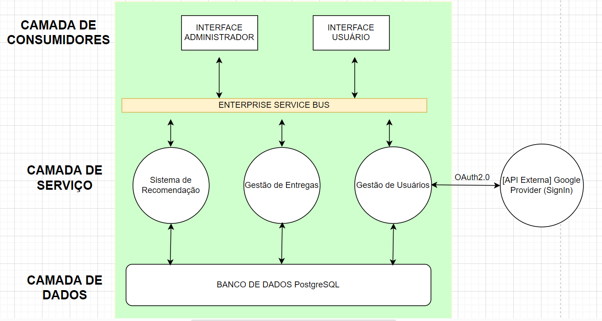
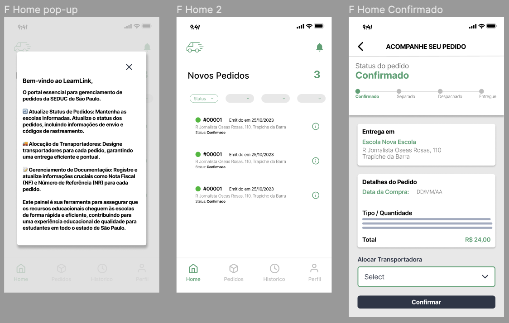

<table>
<tr>
<Table>
  <tr>
    <td><a href= "https://www.educacao.sp.gov.br/"></td>
    <td>
      
    </td>
  </tr>
</table>

# LearnLink

## Easier

## :student: Integrantes:

- <a href="https://www.linkedin.com/in/username/">Maurício Trapnell Felicíssimo</a>
- <a href="https://www.linkedin.com/in/username/">Yago Araújo do Vale Moreira</a>
- <a href="https://www.linkedin.com/in/username/">José Vitor Marcelino</a>
- <a href="https://www.linkedin.com/in/username/">Felipão</a>
- <a href="https://www.linkedin.com/in/username/">Isabela Rocha</a>
- <a href="https://www.linkedin.com/in/username/">Antonio Nassar</a>

## Conteúdo

- [Visão Geral do Projeto](#visão-geral-do-projeto)
  - [Parceiro de Negócios](#parceiro-de-negócios)
  - [Análise da Indústria](#análise-da-indústria)
  - [Problema](#problema)
    - [Análise do Problema](#análise-do-problema)
    - [Matriz SWOT](#análise-do-cenário-e-Matriz-SWOT)
    - [Matriz de Risco](#matriz-de-risco)
    - [Análise Financeira](#analise-financeira)
  - [Proposta da Solução](#proposta-de-solucao)
    - [Descritivo da Solução](#descritivo-da-solucao)
    - [Objetivos](#objetivos)
    - [Proposta de Valor - Value Proposition Canvas](#proposta-de-valor-e-value-proposition-canvas)
    - [Matriz de Avaliação de valor Oceano Azul](#oceano-azul)
  - [Partes Interessadas](#partes-interessadas)
- [Requisitos](#requisitos)
  - [Mapeamento do processo em alto nível](#mapeamento-do-processo-em-alto-nível)
  - [Requisitos Funcionais](#requisitos-funcionais)
  - [Requisitos não Funcionais](#requisitos-não-funcionais)
  - [Perfis de Usuários](#perfis-de-usuários)
  - [Casos de Uso](#casos-de-uso)
- [Arquitetura do Sistema](#arquitetura-do-sistema)
  - [Arquitetura](#arquitetura-SOA)
  - [Instrumentos de Arquitetura](#instrumentos-arquitetura)
- [Interface](#interface-ux-e-ui-design)
  - [Wireframes](#wireframes)
  - [Mockup Navegável](#mockup)
  - [Design de Interface - Guia de Estilos](#design-de-interface---guia-de-estilos)
  - [Análise de Usabilidade](#analise-usabilidade)
- [Projeto de Banco de Dados](#projeto-de-banco-de-dados)
  - [Especificação para recomendação](#especificacao-recomendacao)	
  - [Modelo Conceitual](#modelo-conceitual)
  - [Modelo Lógico](#modelo-conceitual)
- [Projeto de Construção API](#projeto-api)
  - [Modelo de Recomendação Baseado em Filtragem Colaborativa](#modelo-recomendacao)	
  - [Arquitetura de Intregação](#diagramas-uml)
  - [Documentação da API](#documentação-da-api)
- [Testes de Software](#testes-de-software)
  - [Teste Unitário](#teste-unitário)
  - [Teste de Integração](#teste-de-integração)
  - [Teste de Regressão](#teste-de-regressão)
  - [Teste de Usabilidade](#teste-de-usabilidade)
  - [Teste de Funcionalidade](#teste-de-funcionalidade)
  - [Teste de API](#teste-de-api)
- [Manual do Usuário](#manual)
- [Referências](#referências)
- [Apêndice](#apêndice)

# Visão Geral do Projeto
	
A visão geral do projeto é aprimorar o controle de entregas de materiais e suprimentos nas escolas estaduais de São Paulo, sob a gestão da Secretaria da Educação do Estado de São Paulo (SEDUC). O projeto se concentra na criação de um aplicativo móvel eficiente que permitirá o registro, acompanhamento e confirmação de remessas. Essa solução também incluirá a avaliação e recomendação de fornecedores e transportadoras, baseada na qualidade das entregas.

## Parceiro de Negócios

A Secretaria da Educação do Estado de São Paulo é uma instituição de grande porte, encarregada da administração de mais de 5 mil escolas que abrangem desde os anos iniciais ao ensino médio. Sua principal área de atuação é a prestação de serviços educacionais, atendendo a aproximadamente 3.5 milhões de estudantes nas escolas estaduais do estado. Atuando no setor público de educação, a Secretaria desempenha um papel fundamental no sistema educacional do estado, buscando garantir o acesso à educação e a qualidade do ensino público. Seu compromisso se reflete em sua posição de liderança na gestão e administração das escolas, com foco na entrega de educação de qualidade, otimização de recursos e, como evidenciado neste projeto, aprimoramento da gestão logística de entregas.

## Análise da Indústria

A indústria de gestão escolar pública, sob a responsabilidade da Secretaria da Educação do Estado de São Paulo (SEDUC), enfrenta desafios complexos. A SEDUC administra uma vasta rede de escolas que atendem a milhões de estudantes, tornando a gestão eficiente de recursos e serviços uma tarefa desafiadora.

Transparência e prestação de contas são expectativas crescentes da sociedade e órgãos de controle. A SEDUC precisa garantir que seus processos sejam transparentes e acessíveis, a fim de manter a confiança pública.

A eficiência na gestão de recursos é fundamental, já que a SEDUC precisa equilibrar orçamentos limitados com a necessidade de proporcionar uma educação de qualidade. A otimização de processos é vital para reduzir custos desnecessários.

A qualidade dos materiais e suprimentos entregues nas escolas é crucial para a qualidade da educação. Avaliar e selecionar fornecedores confiáveis é essencial para garantir que os produtos entregues atendam aos padrões necessários.

A tecnologia desempenha um papel crescente na gestão escolar pública. O projeto da SEDUC de desenvolver um aplicativo móvel reflete essa tendência, buscando modernizar processos e melhorar a eficiência por meio da tecnologia.

Além disso, a gestão eficiente dos materiais e suprimentos tem um impacto direto na qualidade da educação. Garantir o acesso oportuno a recursos é essencial para oferecer uma educação de alta qualidade.

Toda essa complexidade é ainda agravada pela regulamentação governamental rigorosa que afeta todos os aspectos da gestão escolar pública. Portanto, o cumprimento dessas regulamentações é imperativo.

A colaboração de todas as partes interessadas, incluindo funcionários da SEDUC, gestores escolares, fornecedores e órgãos governamentais, é fundamental para o sucesso do projeto e para garantir que ele atenda às necessidades de todos os envolvidos. Em resumo, o projeto da SEDUC está inserido em um contexto desafiador de gestão escolar pública e busca superar esses desafios para melhorar a qualidade da educação nas escolas públicas do Estado de São Paulo.

## Problema

O problema que o projeto busca resolver é a ineficiência e a falta de transparência no sistema de controle de entregas de materiais e suprimentos para as escolas estaduais do Estado de São Paulo. O sistema atual é propenso a erros e atrasos, o que impacta negativamente a qualidade da educação, a gestão de recursos e a satisfação dos funcionários das escolas. Além disso, a ausência de mecanismos de feedback e avaliação impede a identificação e correção de problemas, tanto no processo de entrega quanto na qualidade dos materiais fornecidos.

### Análise do Problema

<Descreva os problemas identificados e as necessidades do usuário, bem como uma avaliação da situação atual e as possíveis soluções para cada questão. Identifique os obstáculos e limitações do projeto, a fim de assegurar que todas as preocupações sejam abordadas antes do início da implementação. Sejam exaustivos para garantir que todas as perspectivas sejam consideradas para projetar uma solução bem-sucedida.> 

### Matriz SWOT

#### FORÇAS:

- Credibilidade: A SEDUC possui credibilidade de longa data como uma instituição educacional confiável, o que é fundamental para conquistar a confiança de parceiros e partes interessadas.

- Grande Rede de Contatos: A extensa rede de contatos da SEDUC oferece a capacidade de colaborar com uma variedade de partes interessadas, incluindo escolas, fornecedores e organizações educacionais.

#### FRAQUEZAS:

- Restrições Orçamentárias: Restrições orçamentárias definidas pela SEDUC podem limitar a capacidade da SEDUC de implementar melhorias no processo de entrega de remessas.

- Falta de Transparência no Processo de Entrega: A falta de transparência no processo de entrega de remessas pode levar a atrasos e ineficiências na distribuição de recursos educacionais.

- Processos Burocráticos: Processos burocráticos presentes em orgãos públicos podem retardar a implementação de melhorias no processo de entrega de remessas e dificultar a tomada de decisões ágeis.

#### OPORTUNIDADES: 

- Aprimoramento da Eficiência e Eficácia na Entrega de Remessas: A SEDUC tem a oportunidade de aprimorar a eficiência e eficácia no processo de entrega de remessas, garantindo que materiais e recursos cheguem às escolas de maneira transparente e eficiente.

- Uso de Análise de Dados e Inteligência Artificial: A adoção de análise de dados e inteligência artificial pode permitir à SEDUC otimizar o planejamento de remessas e melhorar a logística.

- Avanço Tecnológico: O avanço da tecnologia oferece oportunidades para modernizar a infraestrutura do sistema da SEDUC.

#### AMEAÇAS:

- Integração de Sistemas Legados: A integração de sistemas legados pré-existentes que são utilizados pode ser um desafio técnico, dificultando a modernização do processo de entrega de remessas.

- Regulamentações Governamentais: Mudanças nas regulamentações governamentais podem exigir ajustes nos procedimentos de entrega de remessas da SEDUC.

- Mudanças Políticas: Mudanças no cenário político podem afetar o foco e o financiamento da educação, criando incertezas para projetos de aprimoramento do processo de entrega de remessas.

----

### Matriz de Risco

#### OPORTUNIDADES

- Evitar Extravio de Remessas: Esta oportunidade se concentra em reduzir ou eliminar o extravio de remessas, o que pode ocorrer devido a erros humanos, falhas de comunicação ou outros fatores.

- Acompanhamento de Entregas em Tempo Real: A capacidade de acompanhar as entregas em tempo real é uma oportunidade significativa, pois proporciona visibilidade imediata do progresso das remessas. Isso permite tomar ações rápidas em caso de problemas e fornece informações em tempo real aos usuários sobre o status das entregas.

- Expansão do Projeto para Outras Áreas: A oportunidade de expandir o projeto para outras áreas ou regiões geográficas destaca o potencial de crescimento e escalabilidade do aplicativo. Isso pode aumentar o impacto e a utilidade do sistema, atendendo a uma base de usuários mais ampla.

- Automação do Processo de Entregas: A automação de etapas no processo de entregas reduz a dependência de intervenções humanas e manuais, diminuindo a possbilidade da ocorrência de erros. A automação pode aumentar a eficiência, reduzir erros e proporcionar uma entrega mais rápida e precisa.

- Garantia do Processo de Envio de Remessas: Esta oportunidade diz respeito à capacidade do aplicativo de fornecer garantias sólidas de que o processo de envio de remessas será realizado de forma eficaz e confiável.

#### AMEAÇAS

- Acesso Não Autorizado de Terceiros a Dados Sensíveis: Essa ameaça envolve a possibilidade de pessoas não autorizadas acessarem informações sensíveis, como dados de alunos, materiais e suprimentos. Isso representa um risco à segurança e à privacidade dos dados e pode ter sérias consequências legais

- Transportadoras não Confirmarem a Entrega: Refere-se à possibilidade de as transportadoras não confirmarem a entrega das remessas de forma adequada. Isso pode levar a incertezas e falta de visibilidade sobre o status das entregas, o que afeta a confiabilidade do sistema.

- Burocracia Governamental: Esta ameaça envolve desafios relacionados à conformidade com regulamentos e procedimentos governamentais. A burocracia pode atrasar o processo de desenvolvimento e, consequentemente, a implementação do aplicativo.

- Predição Não Eficiente do Modelo Preditivo: Refere-se à possibilidade de o modelo preditivo, que é responsável por fornecer recomendações de fornecedores ou transportadoras, não ser preciso o suficiente. Isso pode resultar em escolhas inadequadas de fornecedores ou transportadoras, afetando a eficiência das entregas.

- Problemas de Integração entre os Componentes do Sistema: Esta ameaça diz respeito a desafios que podem surgir devido à falta de compatibilidade ou comunicação eficiente entre os diferentes elementos do sistema, como o front-end, banco de dados, APIs e etc. Isso pode resultar em falhas no funcionamento e indisponibilidade do sistema.

### Análise Financeira do Projeto

A análise financeira é um processo que avalia a saúde e viabilidade de um projeto ou empresa, examinando seus dados financeiros para tomar decisões informadas.

Após a entrega dos MVPs, o parceiro disporá de 9 meses para finalizar o desenvolvimento do produto com a ajuda de uma empresa de software. Esta equipe será composta por:

-2 Desenvolvedores Senior Front-End

-2 Desenvolvedores Senior Back-End

-1 DevOps

-1 Product Owner

-1 Estagiário

Uma vez finalizado o produto, um Desenvolvedor Senior será essencial para atender às demandas diárias.

Baseando-se nos custos abaixos:

-Desenvolvedor Senior Frontend: R$ 9.000

-Desenvolvedor Senior Backend: R$ 10.500

-DevOps: R$ 10.000

-Product Owner: R$ 11.000

-Estagiário: R$ 2.000

Incorporando um adicional de 30% para a empresa de software, os custos são:

-Investimento Inicial: R$ 501.831

-Manutenção Mensal (Dev Senior e Manutenção AWS): R$ 12.000

Recomendamos avaliar a potencial redução de custos proporcionada pelo projeto para estimar um retorno sobre o investimento.

Link da Planilha com fluxo mensal:

https://docs.google.com/spreadsheets/d/1be5x5x_5RI2HEQQeUc1rAaqTv1B6LQ2E/edit?usp=sharing&ouid=112815243103396398282&rtpof=true&sd=true

## Proposta de Solução

O projeto visa desenvolver um aplicativo móvel que permitirá o registro, acompanhamento e confirmação de remessas de materiais. Isso melhorará a eficiência, garantindo que as entregas sejam feitas de forma oportuna e precisa, reduzindo erros e atrasos. Além disso, a transparência será aumentada, permitindo que gestores e outros interessados acompanhem o status das entregas em tempo real.

A introdução de um sistema de avaliação e recomendação de fornecedores e transportadoras também visa melhorar a qualidade dos serviços e dos materiais entregues. Isso contribuirá para uma gestão mais eficaz dos recursos, além de melhorar a satisfação dos funcionários das escolas e a qualidade da educação. Em resumo, o projeto visa resolver o problema de ineficiência, falta de transparência e qualidade insuficiente no processo de entrega de materiais nas escolas estaduais de São Paulo.

### Descritivo da Solução

A solução a ser desenvolvida consiste em um aplicativo móvel que resolverá os problemas de controle de entregas de materiais e suprimentos nas escolas estaduais de São Paulo, sob a gestão da Secretaria da Educação do Estado de São Paulo (SEDUC). Essa solução será construída em uma arquitetura em nuvem, com a AWS, para garantir escalabilidade e confiabilidade.

O aplicativo será multiplataforma, compatível com dispositivos Android e iOS, assegurando que um amplo público de usuários, incluindo gestores escolares e fornecedores, possa utilizá-lo.

As principais funcionalidades do aplicativo incluem o registro de remessas, rastreamento em tempo real, notificações instantâneas sobre o status das entregas, avaliação e recomendação de fornecedores, e geração de relatórios detalhados. Os usuários poderão registrar remessas, acompanhar o status das entregas, avaliar fornecedores e gerar relatórios para auditoria e análise.

A utilização da AWS garantirá que o aplicativo seja capaz de lidar com a demanda de todas as escolas do estado, proporcionando escalabilidade e alta disponibilidade. A arquitetura mobile multiplataforma assegura que a maioria dos usuários possa acessar e utilizar o aplicativo de forma eficaz.

Essa solução visa resolver o problema de ineficiência, falta de transparência e qualidade insuficiente no processo de entrega de materiais nas escolas estaduais de São Paulo, melhorando a gestão de recursos e, em última instância, a qualidade da educação oferecida.

### Objetivos

Os objetivos do projeto são aprimorar o controle de entregas de materiais e suprimentos nas escolas estaduais de São Paulo, administradas pela Secretaria da Educação do Estado de São Paulo (SEDUC). Os benefícios esperados são significativos. Primeiramente, o projeto visa melhorar a eficiência do processo de entrega, reduzindo atrasos e erros, o que resultará em uma gestão de recursos mais eficaz. A transparência aumentará, permitindo que gestores e outros interessados acompanhem o status das entregas em tempo real. Isso facilitará o processo de auditoria e geração de relatórios, contribuindo para uma melhor gestão de recursos.

Além disso, a satisfação dos funcionários das escolas será melhorada devido a um sistema mais eficiente e transparente. A qualidade dos materiais e suprimentos entregues também aumentará, o que, por sua vez, impactará positivamente a qualidade da educação. O projeto permitirá ainda aprimorar o processo de compras, com base na análise dos fornecedores que entregam com mais qualidade e menos problemas.

### Proposta de Valor - Value Proposition Canvas

### Matriz de avaliação de valor Oceano Azul

Link da planilha com a Matriz de avaliação de valor Oceano Azul

https://docs.google.com/spreadsheets/d/1nCOaT6kzHbnuxcAdE_JMYII0-zklB6RB/edit#gid=260133923

## Partes Interessadas 

A Secretaria da Educação do Estado de São Paulo (SEDUC) é o principal stakeholder e o promotor do projeto. Sua responsabilidade inclui definir os requisitos e objetivos, bem como supervisionar a implementação e a integração do aplicativo com os sistemas existentes. A SEDUC também desempenha um papel fundamental na avaliação e recomendação de fornecedores e transportadoras.

Os fornecedores de materiais e transportadoras são partes cruciais no processo de entrega e, portanto, são stakeholders-chave. Eles têm a responsabilidade de usar o aplicativo para registrar, rastrear e confirmar as remessas, bem como de responder às avaliações dos usuários.

Os gestores e funcionários das escolas estaduais são outros stakeholders essenciais. Eles são usuários do aplicativo e têm a tarefa de acompanhar as entregas, confirmar a recepção dos materiais e avaliar a qualidade dos serviços e dos materiais entregues.

# Requisitos

Neste capítulo, abordaremos os requisitos, componentes essenciais no desenvolvimento de software. Eles definem o que o sistema deve realizar e como deve operar. Exploraremos os Requisitos Funcionais, que descrevem as funcionalidades específicas do software, e os Requisitos Não Funcionais, que detalham as características qualitativas, como desempenho e segurança. A compreensão clara destes elementos é crucial para garantir um software eficaz e alinhado às necessidades do usuário.

## Mapeamento do processo em alto nível

[Mapeamento do Processo v2.pdf](https://github.com/2023M6T6Inteli/grupo2/files/13196450/Mapeamento.do.Processo.v2.pdf)

## Requisitos Funcionais

Os requisitos funcionais de um sistemas são como um guia para dizer ao sistema o que fazer, também como o sistema recebe informações, o que faz com esses dados e quais resultados são esperados. Abordam também aspectos como a aparência e a facilidade de uso, segurança e confiabilidade. Em um geral, são detalhadas para garantir que o sistema atenda às necessidades dos usuários que o utiliza. 
### RF 1: Dashboard de Monitoramento de Tempo de Entrega de Materias e Suprimentos

**Descrição:**
O sistema deverá fornecer um dashboard que exiba informações em tempo real sobre os tempos absolutos e médios de entrega de materiais e suprimentos às escolas estaduais. O dashboard mostrará dados como o tempo estimado e o tempo médio de entrega por macroregião, permitindo aos gestores uma visão geral sobre a eficiência logística.

**Descrições de Testes**

**Pré-condição:**
- O usuário deve estar logado no sistema como um administrador ou gestor escolar.
- Existem dados de entregas anteriores carregados no sistema.

**Procedimento de Teste:**
1. O usuário acessa o aplicativo e efetua login com credenciais válidas.
2. Navega até a seção do dashboard de monitoramento de tempo de entrega.
3. Verifica se os tempos absolutos e médios de entrega de materiais e suprimentos são exibidos corretamente.
4. Compara os dados exibidos no dashboard com os registros de entrega para garantir a precisão dos dados exibidos.

**Resultado Esperado:**
- O dashboard deve exibir as informações de forma clara e precisa.
- Os dados apresentados podem não ser consistentes com os registros de entrega existentes, visto que o intuito é avaliar a eficiência de entrega.

**Pós-condição:**
- O usuário escola é capaz de visualizar, filtrar e analisar os tempos de entrega diretamente do dashboard.

**Critérios de Aceitação:**
- Usabilidade: O dashboard deve ser intuitivo, permitindo aos usuários visualizar e analisar os dados de tempo de entrega com eficiência e eficácia.

### RF 2: Autenticação de Usuário

**Descrição:**
O sistema deve fornecer um mecanismo de autenticação para todos os usuários (funcionários da SEDUC, fornecedores de materiais, transportadoras), que desejam acessar o aplicativo. A autenticação é necessária para garantir que apenas usuários autorizados possam registrar, acompanhar, confirmar remessas e acessar informações relevantes sobre entregas, avaliações e recomendações de fornecedores e transportadoras.

**Pré-condição:**
- O usuário possui um dispositivo móvel com o aplicativo instalado.
- O usuário está conectado a uma rede de internet disponível.
- O usuário possui credenciais de autenticação (nome de usuário e senha) ou outro método de autenticação aprovado pela SEDUC.

**Procedimento de Teste:**
1. O usuário inicia o aplicativo móvel.
2. Na tela de login, o usuário insere suas credenciais de autenticação (nome de usuário e senha) nos campos apropriados.
3. O usuário seleciona a opção de login.

**Resultado Esperado:**
- Se as credenciais de autenticação forem válidas e correspondentes aos registros do sistema, o usuário deve ser autenticado com sucesso e redirecionado para a tela principal do aplicativo.
- Se as credenciais forem inválidas, o sistema deve exibir uma mensagem de erro informando ao usuário que as credenciais são incorretas e permitir que ele tente novamente.

**Pós-condição:**
- O usuário autenticado tem acesso às funcionalidades do aplicativo de acordo com suas permissões, que podem variar de acordo com seu papel (funcionário da SEDUC, fornecedor ou transportadora).

**Critérios de Aceitação:**
- O sistema deve ser capaz de autenticar os usuários com sucesso usando suas credenciais.

### RF 3: Gestão de Usuários (Fornecedor, escolas e admin)

**Descrição:**
O sistema de Gestão de Usuários deve permitir a criação, atualização e exclusão de contas de usuários para fornecedores, escolas e administradores.

**Descrições de Testes**

**Pré-condição:**
O usuário deve estar autenticado no sistema como um administrador com permissões de gerenciamento de usuários.  

**Procedimento de Teste:**
1. O administrador faz login no sistema.
2. O administrador acessa a seção de "Gestão de Usuários".
3. O administrador seleciona a opção de "Criar Novo Usuário".
4. O administrador preenche os detalhes do usuário, incluindo nome, tipo de usuário (fornecedor, escola ou administrador), endereço de e-mail, senha, etc.
5. O administrador clica no botão "Salvar" para criar o usuário.
6. O administrador pode também selecionar um usuário existente para editar ou excluir.
7. Para edição, o administrador pode modificar os detalhes do usuário e clicar em "Salvar".
8. Para exclusão, o administrador pode confirmar a exclusão do usuário.

**Resultado Esperado:**
- Após a criação bem-sucedida de um novo usuário, o sistema deve armazenar as informações do usuário no banco de dados.
- Após a edição bem-sucedida de um usuário, as informações do usuário devem ser atualizadas no sistema.
- Após a exclusão bem-sucedida de um usuário, o usuário deve ser removido do sistema.

**Pós-condição:**
- Novos usuários são adicionados ao sistema com sucesso, com todas as informações relevantes.
- As informações dos usuários existentes são atualizadas conforme necessário.
- Os usuários excluídos são removidos do sistema.

**Critérios de Aceitação:**
1. Apenas administradores têm acesso à função de "Gestão de Usuários".
2. Todos os campos obrigatórios devem ser preenchidos ao criar ou editar um usuário.
3. O sistema deve validar que o endereço de e-mail é único entre os usuários.
4. Após a criação, edição ou exclusão de um usuário, o sistema deve fornecer feedback visual sobre o resultado da ação.
5. Os administradores devem ser capazes de visualizar, editar e excluir contas de usuários existentes.
6. Os usuários criados devem ter permissões de acordo com o tipo de usuário (fornecedor, escola ou administrador) especificado no cadastro.

### RF 4: O Usuário deve ser capaz de acompanhar o status de uma remessa.

#### Descrição: 
O usuário deve conseguir acessar informações referentes a situação de entrega de uma remessa, como por exemplo, horários (de retirada, de chegada), local da entrega, previsão de entrega, conteúdo da remessa e etc. Esse status deve estar disponível ao usuário para que ele possa notar caso haja algum problema durante a entrega.

### RF 5: O usuário deve conseguir criar uma nova entrega.

#### Descrição: 
O usuário deve conseguir cadastrar uma nova entrega e adicionar os dados referentes a essa entrega por meio de um formulário, esses dados devem ser alocados em um banco de dados. 

### RF 6: O usuário deve ser capaz de confirmar uma entrega.

#### Descrição: 
O usuário deve ser capaz de confirmar a conclusão de uma entrega. Essa confirmação deve ser realizada utilizando provas, como por exemplo, assinatura digital, fotos, documentos e etc. Essa confirmação deve ser feita para assegurar a integridade da entrega.

### RF 7: O usuário deve ser capaz de acessar informações detalhadas sobre entregas específicas.

#### Descrição: 
Ao selecionar uma entrega na lista do painel de controle, o usuário deve ser redirecionado para uma página dedicada que contém todas as informações relevantes sobre a entrega em questão. Esse acesso individual proporciona ao usuário um controle mais preciso sobre as entregas e a capacidade de realizar consultas detalhadas quando necessário.

### RF 8: O usuário deve poder relatar problemas relacionados às entregas.

#### Descrição: 
Os usuários devem ter a capacidade de informar à equipe da SEDUC sobre quaisquer problemas que possam surgir durante o processo de entrega das remessas. Esses relatórios serão encaminhados a um responsável na SEDUC, permitindo que as medidas apropriadas sejam tomadas de acordo com o contexto do relato. Isso contribui para que a SEDUC possa identificar e investigar entregas que requerem atenção especial para a resolução de problemas.

### RF 9: Painel de Análise de Desempenho de Fornecedores e Transportadoras

#### Descrição:

O usuário da SEDUC, deve ter um painel de análise de desempenho de fornecedores e transportadoras no sistema, permitindo monitorar e avaliar o desempenho desses parceiros de entrega. O painel deve exibir dados essenciais, como por exemplo : tempo de entrega, qualidade da entrega e quantidade de entregas, para que seja possível possa tomar decisões informadas sobre quais fornecedores e transportadoras são mais eficientes e confiáveis. A interface do painel deve ser intuitiva e lúdica, permitindo  a visualização de informações em tempo real, facilitando a análise e tomada de decisões para otimizar o processo de entrega de materiais e suprimentos nas escolas estaduais.

### RF 10: Sistema de recomendação de fornecedoras

#### Descrição:

O usuário SEDUC deve ter acesso a um sistema de recomendação de fornecedoras para saber qual fornecedora é a mais adequada para cada tipo de remessa. O sistema deve ser simples e o usuário deve ter acesso apenas clicando em um botão para conseguir ter acesso a funcionalidade. Isso facilitará tomada de decisões baseada em dados.

## Requisitos não Funcionais

### RNF 1: Segurança

**Descrição:**
Garantir a segurança dos dados e da infraestrutura do sistema de acordo com as melhores práticas de segurança da informação.

**Razão:**
Proteger os dados sensíveis, a privacidade dos usuários e a integridade do sistema contra ameaças de segurança.

**Critérios de Cumprimento:**

1. O sistema deve ser protegido contra acesso não autorizado.
2. As senhas dos usuários devem ser armazenadas de forma segura, utilizando técnicas de hash e salting.
3. Todas as comunicações entre o cliente e o servidor devem ser criptografadas usando protocolos seguros, como HTTPS.
4. Deve ser mantido um registro de atividades de usuário e logs de segurança para 'rastrea'r eventos e ações suspeitas.

**Impacto:**
O cumprimento deste requisito não funcional garantirá a confidencialidade, integridade e disponibilidade dos dados, além de proteger o sistema contra ameaças de segurança, minimizando riscos para os usuários e a organização.

### RNF 2: Eficiência 

**Descrição:**
O sistema deve ser capaz de processar grandes volumes de dados de entregas sem comprometer o desempenho. Deve também especificar o número máximo de entregas que o sistema tem que ser capaz de gerenciar.
**Razão:**
Suprir as necessidades dos usuários que desejam saber as informações sobre os materiais, já que esses dados estão em grande escala.
Critérios de Cumprimento:A partir dos dados fornecidos, devemos considerar o tempo como essencial, assim, quando fizermos uma pesquisa, o sistema irá responder em um tempo rápido. 
**Impacto:**
O cumprimento deste requisito não funcional garantirá a entrega e informações exatas sobre os dados dos materiais, garantindo uma eficiência melhor na escalabilidade do app.

### RNF 3: Usabilidade
**Descrição:** O sistema deve atender a requisitos de usabilidade para garantir que os usuários, incluindo funcionários da SEDUC, fornecedores e transportadoras, possam interagir com o aplicativo de forma intuitiva e eficiente. A usabilidade é fundamental para garantir que o sistema seja amigável, fácil de aprender e de usar, resultando em uma experiência positiva do usuário.

**Descrição de Testes**

**Pré-condição:**
O sistema está disponível e funcional.
Os usuários têm acesso às devidas permissões para utilizar o sistema.

**Procedimento de Teste:**
Usuário inicia o aplicativo móvel.
O usuário navega pelas diferentes funcionalidades do sistema, incluindo autenticação, listagem de entregas, confirmação de entrega, cadastro de entregas e visualização de status.
O usuário tenta realizar tarefas comuns, como acessar a lista de entregas, confirmar uma entrega, criar uma nova entrega e visualizar o status de uma entrega específica.
O usuário avalia a facilidade de navegação, a clareza das informações apresentadas, a organização das telas e a eficiência das ações.

**Resultado Esperado:**
O sistema deve ser intuitivo, permitindo que os usuários naveguem sem dificuldade.
As informações devem ser apresentadas de forma clara e organizada.
As ações comuns, como confirmar uma entrega, criar uma nova entrega e visualizar o status, devem ser realizadas facilmente.
Os usuários devem se sentir à vontade com a interface do aplicativo.

**Pós-condição:**
Os usuários devem ser capazes de usar o sistema com eficiência e satisfação.
Os usuários devem relatar uma experiência de uso positiva, indicando que o sistema atendeu aos requisitos de usabilidade.

**Critérios de Aceitação:**
Os usuários devem ser capazes de realizar tarefas comuns no sistema sem a necessidade de treinamento adicional.
Os usuários não devem encontrar obstáculos significativos durante a navegação e a execução de tarefas.
Os feedbacks dos usuários devem indicar que o sistema é intuitivo e amigável.
A taxa de erros de entrada de dados e navegação deve ser baixa.

## Perfis de Usuários 

Nosso sistema será desenvolvido pensando em 4 perfis de usuários diferentes, cada perfil possui funções específicas e permissões dentro de sistema diferentes.

### SEDUC
A SEDUC (Secretaria de Educação do Estado de São Paulo) assume a responsabilidade de criar novos pedidos e gerenciar o fluxo completo de entregas de remessas.

### Fornecedora
A fornecedora desempenha um papel fundamental como a responsável pelo envio e qualidade do conteúdo das entregas, além de coordenar as transportadoras contratadas para efetuar a entrega das remessas.

### Transportadora
A transportadora é o peça central na cadeia, sendo encarregada da entrega das remessas e da confirmação do recebimento no destino.

### Escola
A escola desempenha o papel de destinatária final, recebendo as entregas e avaliando a qualidade da experiência ao longo de todo o processo.

---

## Casos de Uso

### UC1 
 _Como escola, quero conseguir ter acesso e visualizar sempre que quiser, o status de uma entrega para meu endereço para que eu possa planejar o recebimento dela._

 Descrição:
 Os usuários da escola devem ter a capacidade de acessar informações relativas às entregas destinadas a eles. Para isso, os usuários podem acessar a lista de entregas, na qual terão acesso apenas às entregas designadas para eles. Nessa lista, eles têm a opção de selecionar uma entrega específica para obter informações detalhadas sobre o seu status, incluindo a fase atual em que a entrega se encontra. Além disso, se desejarem, os usuários podem verificar a previsão de entrega, que indica a data provável de chegada da entrega em suas mãos.

 

---

### UC2
 _Eu, como SEDUC, quero poder ter acesso e visualizar sempre que quiser, o status de todas as entregas já registradas._

 Descrição:
Os usuários da SEDUC devem ter a capacidade de acessar o status de todas as entregas registradas no sistema, a fim de manter um controle abrangente sobre o andamento de todas as remessas. Para isso, eles podem utilizar a funcionalidade de 'Listagem de Entregas'. A partir desse painel, os usuários têm a possibilidade de verificar o status de entregas específicas e, se necessário, revisar os registros detalhados de cada entrega, incluindo logs relevantes. Além disso, os usuários podem entrar em contato com a transportadora, caso surjam necessidades específicas. Essa funcionalidade também permite aos usuários rastrear em qual etapa do processo cada entrega se encontra e obter uma estimativa da data de entrega.

---

### UC3
 _Eu, como transportadora, devo ser capaz de confirmar uma entrega finalizada para garantir a conclusão de uma entrega._

 Descrição:
Para garantir a integridade do processo, o usuário da transportadora deve ser capaz de confirmar uma entrega de forma eficaz. Esse procedimento de confirmação requer que o usuário da transportadora acesse a entrega específica que deseja confirmar. Em seguida, ele deve clicar no botão de 'Confirmação de Entrega', fornecendo o código de confirmação fornecido pelo responsável da escola, juntamente com o CPF deste último como autenticação.

---

### UC4
 _Eu, como SEDUC, devo conseguir cadastrar as entregas a partir das compras com fornecedoras para que seja possível documentar essas entregas no sistema._

 Descrição:
Os usuários da SEDUC têm a capacidade de registrar entregas com base em suas compras. Para realizar esse processo, eles devem acessar a lista de entregas e selecionar a opção 'Criar Nova Entrega'. Ao fazer isso, é necessário preencher um formulário contendo informações cruciais sobre a entrega, como conteúdo, data da compra, número da nota fiscal, entre outros detalhes relevantes. Além disso, eles têm a flexibilidade de atribuir essas entregas a fornecedores e transportadoras específicos. Da mesma forma, as fornecedoras também têm a opção de alocar transportadoras para as respectivas entregas, tornando o processo de registro e gerenciamento de entregas mais completo e eficiente.

---

### UC5
 _Eu, como SEDUC, devo conseguir fazer a gestão das escolas no meu sistema e possibilitar que elas visualizem os seus dados._

 Descrição:
Os usuários da SEDUC conseguem fazer o login como administradores e manipular os dados referentes as escolas. Ações como: criação, atualização e deleção são possíveis para esse tipo de usuário. Além disso, a escola também consegue visualizar os seus dados dentro da aplicação.

----

## Matriz de Rastreabilidade 

- UC1:
  Necessita do RF1, RF4, RF7 e RF8

- UC2:
  Necessita do RF1, RF4 e RF7 

- UC3:
  Necessita do RF1, RF6 e RF7

- UC4:
  Necessita do RF1 e RF5

- UC5:
  Necessita do RF2 e RF3

- UC6:
  Necessita do RF4, RF8 e RF9

----

# Arquitetura do Sistema

Nas próximas seções, entraremos em detalhes os principais elementos que compõem essa arquitetura do nosso projeto sua e contribuição para o funcionamento eficiente do nosso sistema como um todo. Este capítulo trará uma visão dos fundamentos que compõem nossa solução, proporcionando uma compreensão de sua estrutura.

O sistema Learnk utiliza a arquitetura SOA (Service-Oriented Architeture) para funcionar. Com esse padrão, o sistema consegue alcançar uma alta escalabilidade, disponibilidade de 98% e o nível ideal de desacoplamento entre componentes do sistema.

## Arquitetura SOA

* O diagrama acima é dividido em três partes: 

  - **Camada de Consumidores**: onde fica as interfaces do sistema. Cada uma é utilizada por um tipo especifício de cliente (administrador ou usuário). concentram-se as interfaces do sistema destinadas a diferentes tipos de usuários, como administradores e usuários finais. Essa camada tem como objetivo otimizar a experiência do usuário, fornecendo interfaces especializadas para atender às necessidades específicas de cada categoria de cliente.

  - **Camada de Serviços**: nessa parte, são disponibilizadas API´s como serviço para que interfaces possam consumí-las por meio da intermediação do Enterprise Service Bus (ESB). Aqui, API's são disponibilizadas como serviços, acessíveis para as interfaces por meio do Enterprise Service Bus (ESB). Essa abordagem proporciona uma arquitetura flexível e modular, permitindo que as interfaces consumam serviços de maneira eficiente e padronizada. O ESB atua como um facilitador na comunicação entre as interfaces e os serviços, garantindo uma integração coesa e simplificada.

  - **Camada de Dados**: por fim, aqui ficarão as bases de dados que serão utilizidas para trafegar informações entre o sistema e também para atualizar o sistema de recomendação.Abriga também as bases de dados  para a movimentação de informações e a atualização do sistema de recomendação. Essa separação permite uma gestão mais eficaz dos dados, facilitando operações de leitura e gravação. 

## Instrumentos de Arquitetura SOA

### Tecnologias Utilizadas

#### Mobile
- **React Native**: React Native é uma biblioteca JavaScript para criar aplicativos móveis nativos para Android e iOS. Ele permite que você desenvolva aplicativos usando uma única base de código em JavaScript e o mesmo design de componentes do React.

#### Backend
- **Typescript**: TypeScript é um superset do JavaScript que adiciona tipagem estática ao código JavaScript. Ele ajuda a detectar erros de código em tempo de desenvolvimento, tornando-o mais robusto.
- **Node.js**: Node.js é um ambiente de tempo de execução JavaScript que permite executar código JavaScript no lado do servidor. É amplamente utilizado para construir aplicativos da web escaláveis e em tempo real.
- **Nest.js**: Nest.js é um framework de desenvolvimento de aplicativos da web para Node.js. Ele fornece uma arquitetura modular, orientada a componentes e é conhecido por sua escalabilidade e facilidade de manutenção.
- **Flask**: Flask é um micro-framework para desenvolvimento web em Python. Oferece simplicidade, flexibilidade e capacidade de extensão, sendo ideal para projetos pequenos a médios. Permite a construção de aplicações web de maneira rápida e com mínima linha de código.

#### Análise de Dados e Machine Learning
- **Python**: Python é uma linguagem de programação amplamente usada em análise de dados e machine learning devido à sua simplicidade e uma grande quantidade de bibliotecas disponíveis.
- **NumPy**: NumPy é uma biblioteca Python que fornece suporte para arrays multidimensionais e funções matemáticas de alto desempenho, tornando-o fundamental para computação científica.
- **Scikit-Learn**: Scikit-Learn é uma biblioteca Python de código aberto que oferece ferramentas simples e eficazes para aprendizado de máquina e análise de dados. Ela inclui uma variedade de algoritmos de aprendizado de máquina e utilitários para pré-processamento de dados.
- **Pandas**: Pandas é uma biblioteca Python de código aberto que fornece estruturas de dados e ferramentas de análise de dados de alto desempenho e fáceis de usar. É amplamente utilizada para manipulação e análise de dados, suportando diversas operações como indexação, alinhamento e merge de dados.
- **Plotly**: Plotly é uma biblioteca gráfica interativa para Python. Permite a criação de gráficos complexos e interativos de maneira simples, sendo muito útil para análise de dados e visualização científica.
- **Surprise**: Surprise é uma biblioteca Python para construção e análise de sistemas de recomendação. Oferece diversas opções de algoritmos de recomendação e ferramentas para avaliação de desempenho, sendo ideal para experimentos e prototipagem em sistemas de recomendação.
- **JobLib**: JobLib é uma biblioteca Python usada para salvar e carregar objetos Python de maneira eficiente, especialmente útil para grandes quantidades de dados. É frequentemente usada em conjunto com Scikit-Learn para salvar e carregar modelos de machine learning.
- **UniTTest**: UniTTest é um framework de testes unitários para Python. Permite a criação de testes automatizados, fornecendo uma maneira de validar o código e assegurar que as alterações não quebrem funcionalidades existentes.

#### Banco de Dados
- **PostgreSQL**: PostgreSQL é um sistema de gerenciamento de banco de dados relacional de código aberto. Ele é conhecido por sua confiabilidade, escalabilidade e recursos avançados, tornando-o uma escolha popular para armazenamento de dados em aplicativos empresariais e projetos de código aberto.

# Interface

Neste capítulo, mergulharemos no domínio das interfaces, elementos vitais que determinam como os usuários interagem e experimentam um sistema. A interface é a ponte entre o usuário e a funcionalidade do software, e sua concepção e design são cruciais para a eficácia e aceitação do sistema.

Começaremos com o Wireframe, esboçando a estrutura básica e layout da interface. Em seguida, avançaremos para o Mockup Navegável, proporcionando uma representação visual mais refinada e interativa da interface. O Design de Interface - Guia de Estilos detalhará a estética, incluindo cores, tipografia e elementos gráficos, assegurando consistência e coesão. Por fim, a Análise de Usabilidade examinará a eficiência, eficácia e satisfação do usuário ao interagir com a interface.

<Obs.: Este capítulo aborda o design e a funcionalidade da aplicação ou sistema em questão. Ela fornece informações sobre como o software é projetado para ser fácil de usar e intuitivo para os usuários. Nesta seção, deve ser possível encontrar descrições detalhadas sobre as principais características e recursos da interface do usuário, como botões, menus, ícones e outros elementos que são utilizados para facilitar a interação do usuário com o software. Além disso, são fornecidos exemplos de como as funcionalidades do software são acessadas e usadas pelos usuários, incluindo informações sobre os passos necessários para realizar tarefas específicas. Esta seção também aborda as principais preocupações de UX, como acessibilidade, usabilidade, consistência e simplicidade. São apresentados exemplos de como o software é projetado para atender às necessidades dos usuários com diferentes tipos de habilidades e recursos.>

## Wireframes

**1. Tela: Home**

-Cabeçalho: Logo no início da plataforma com a opção de ir para central de notificações.

-Rodapé: Possui botões de navegação rápido para "Home", "Pedidos", "Históricos" e "Perfil". No caso do usuário Seduc temos a opção adicional "Criação de Pedido".

-Área de conteúdo:

**SEDUC:** Nessa parte temos um dashboard interativo com KPIs e dados relevantes, tendo na parte superior as opções de alterar para o "Dashboard de Tempo" e "Sistema de recomendação".

**Fornecedor:** Abrirá logo no início um pop-up  informando sobre a finalidade da plataforma. Após o fechamento do pop-up, uma lista atualizável de pedidos pendentes de preenchimento aparecerá .

**Escola:** Abrirá no início um oop-up inicial explicativo sobre o uso e propósito do app. Após o fechamento do mesmo, aparecerá as informações dos pedidos para o usuário da escola.

Home Seduc

Home Fornecedor e Escola Pop-up

Home Fornecedor Pedidos Pendentes

**2. Tela: Pedidos**

-Cabeçalho: Título da página "Pedidos", opção de ir para central de notificações e botão de "voltar".

-Rodapé: Botões de navegação rápido para "Home", "Pedidos", "Históricos" e "Perfil". No caso da Seduc temos a opção adicional "Criação de Pedido".

-Área de conteúdo: Nessa área aparecerá a lista de pedidos com detalhes básicos, destacando os status dos pedidos, com opção de detalhamento para cada item.

Pedidos Tela Escola e Fornecedor

[
]

**3. Tela: Históricos**

-Cabeçalho: Título "Históricos", opção de ir para central de notificações e botão de "voltar".

-Rodapé: Botões de navegação rápido para "Home", "Pedidos", "Históricos" e "Perfil". No caso da Seduc temos a opção adicional "Criação de Pedido"

-Área de conteúdo: Aparecerá a listagem pedidos realizados com notas e status de avaliação, com opção de detalhamento para cada item.

[
]

**4. Tela: Perfil**

-Cabeçalho: Título "Perfil" para Fornecededor e Escola, para a Seduc o título será "Gestão de Usuários".

-Rodapé: Botões de navegação rápido para "Home", "Pedidos", "Históricos" e "Perfil". No caso da Seduc temos a opção adicional "Criação de Pedido".

-Área de conteúdo: Nessa parte aparecerá detalhes do perfil do usuário SEDUC, com opções adicionais para gestão de usuários.

[
]

**5. Tela: Criação de Pedido (Exclusiva para SEDUC)**

-Cabeçalho: Título "Criação de Pedido", opção de ir para central de notificações e botão de "voltar".

-Rodapé: Botões de navegação rápido para "Home", "Pedidos", "Históricos" e "Perfil". No caso da Seduc temos a opção adicional "Criação de Pedido".

-Área de conteúdo: Formulário de entrada para os detalhes básicos do pedido. Ao concluir, notificação é enviada aos fornecedores para atualização.

[
]

**6. Tela: Status Pedido**

-Cabeçalho: Título "Status do Pedido", opção de ir para central de notificações e botão de "voltar".

-Rodapé: Botões de navegação rápido para "Home", "Pedidos", "Históricos" e "Perfil". No caso da Seduc temos a opção adicional "Criação de Pedido".

-Área de conteúdo: Detalhes do pedido, como número do pedido, data de criaçã, fornecedor, endereço, etc.
apresenta também a linha do tempo visual mostrando o progresso do pedido, desde sua criação até a entrega (ou estado atual).

[
]

**7. Tela: Avaliação de Pedido (Para Escolas)**

-Cabeçalho: Título "Avaliar Pedido", opção de ir para central de notificações e botão de "voltar".

-Rodapé: Botões de navegação rápido para "Home", "Pedidos", "Históricos" e "Perfil". No caso da Seduc temos a opção adicional "Criação de Pedido".

-Área de conteúdo:
Integridade da carga: Escala de avaliação por estrelas indo de 1 a 5.
Atendimento: Escala de avaliação por estrelas indo de 1 a 5.
Entregou no prazo?: Opções de "Sim" ou "Não".
Quantidade correta?: Opções de "Sim" ou "Não".

[
]

### Justificativa das Escolhas de Design:

Considerando que o aplicativo será utilizado por usuários diferentes, a decisão de modelar nossa interface tendo como base a plataforma do iFood foi devido à sua ampla aceitação e familiaridade entre os usuários. O iFood é reconhecido por sua interface intuitiva e eficaz, o que facilita a adaptação dos usuários ao nosso aplicativo.

### Estrutura e Organização: 

A fim de garantir a melhor experiência para o usuário, optamos em não utilizar um menu retrátil por entender que nosso aplicativo tem poucas funcionalides e um uso rápido, o uso de um menu retrátil não traria ganhos relevantes em usabilidade, podendo inclusive causar confusões, conforme padrão do iFood e Instagram. Optamos por uma barra de navegação inferior, por achar que otimiza a experiência mobile, apresentando os ícones essenciais para a navegação principal, garantindo uma sequência lógica de toques e gestos.

Layout Mobile: Focado em clareza e simplicidade, para que o usuário atinja os seus objetivos sem distração e rapidez, garantimos espaçamentos adequados para toques e tamanhos de fonte legíveis, evitando assim erros de toque e melhorando a legibilidade. Além disso, otimizamos o layout para diferentes resoluções de tela.

Visualização de Dados para Mobile: Simplificamos gráficos e tabelas para uma visualização mais clara em dispositivos móveis. Os dashboards são apresentados de forma concisa e eficaz, com descritivos e títulos sobre seus propósitos, dividimos em 3 quadros, onde 1 quadro terá um gráfico, 1 terá informações descritivas do gráfico e mais 1 quadro terá interações para alterar a visualização do gráfico. Acreditamos que assim garantimos que os usuários obtenham informações rapidamente, mesmo em telas menores.

### Técnicas Mobile Avançadas:

Foco no Mobile First: Adotamos a estratégia "Mobile First", começamos o design pela versão mobile. Esta técnica nos permitiu focar nos elementos essenciais, assegurando que as funcionalidades cruciais estejam sempre em primeiro plano e acessíveis. Ao projetar primeiro para dispositivos móveis, caso se deseje implementar posteriormente para telas maiores, como tablets ou desktops, asseguramos uma transição suave e coesa em todas as plataformas.

One Hand: Observando que muitos usuários operam dispositivos com uma mão, otimizamos nossa interface para essa realidade. Elementos essenciais como "Mais Informações", "Avaliar" e "Filtrar" foram posicionados no lado direito, facilitando o acesso com o polegar. Isso melhora a fluidez da navegação e permite acessar rapidamente as avaliações, crucial para decisões em aplicativos de entrega.

Notificações: Implementamos um sistema de notificações para manter os usuários atualizados. Essas alertas são projetadas para serem discretas e relevantes, garantindo que o usuário receba informações cruciais sem ser sobrecarregado.

Design Responsivo Adaptativo: Nosso design se ajusta automaticamente a diferentes tamanhos e orientações de tela, garantindo uma experiência otimizada para todos os dispositivos.

Link para o Wireframe
<https://www.figma.com/file/6mPcIx7yRzbMFb7oY3JRUT/Wireframe-Projeto-Learn-Link?type=design&node-id=53-3048&mode=design&t=YyIw99f4uaxSDEgh-0>

## Mockup Navegável

Link para o mockup:

https://www.figma.com/file/6mPcIx7yRzbMFb7oY3JRUT/Wireframe-Projeto-Learn-Link?type=design&node-id=53-3048&mode=design&t=GyWFUHrX1c3MeNHY-0

Link para o mockup navegável:

https://www.figma.com/proto/6mPcIx7yRzbMFb7oY3JRUT/Wireframe-Projeto-Learn-Link?page-id=53%3A3048&type=design&node-id=276-21627&viewport=305%2C-3677%2C0.19&t=D0f1A4eRdoOhf1Yj-1&scaling=scale-down&starting-point-node-id=276%3A21627

#### Mockup SEDUC
**Home:**  
 
**Pedidos:**  
 
**Criar Pedido:**  
 
**Historico:**  
 
**Perfil / Gestão de Usuarios:**  
 

#### Mockup Fornecedora
**Home:**  
 
**Pedidos:**  
 
**Historico:**  
 
**Perfil:**  
 

#### Mockup Transportadora
**Home:**  
 
**Pedidos:**  
 
**Historico:**  
 
**Perfil:**  
 

#### Mockup Escola
**Home:**  
 
**Pedidos:**  
 
**Historico:**  
 
**Perfil:**  
 

## Design de Interface - Guia de Estilos
Mockup Navegável e Abordagem Mobile First:
Diante da necessidade de uma plataforma eficaz para gerenciar a aquisição e distribuição de materiais escolares, reconhecemos a importância de desenvolver um wireframe e um mockup navegável com uma abordagem 'Mobile First'. Essa estratégia é essencial não apenas para alinhar as ideias de design e desenvolvimento, mas também para atender às expectativas de um público que utiliza predominantemente dispositivos móveis em seu cotidiano.
Com foco nessa realidade, realizamos uma análise aprofundada dos componentes visuais, considerando as diretrizes de experiência do usuário (UX) para criar um wireframe e um mockup de alta fidelidade. Esses elementos foram cuidadosamente projetados para serem atraentes e intuitivos, garantindo que a plataforma seja de fácil compreensão e uso, mesmo para aqueles menos familiarizados com tecnologias digitais.
O mockup navegável, em particular, oferece uma visão clara de como os usuários, sejam eles membros da SEDUC, fornecedores ou responsáveis escolares, interagem com a aplicação. Ele demonstra o percurso do usuário dentro da plataforma, destacando as etapas principais para a realização de suas tarefas. Esse fluxo de navegação é otimizado para dispositivos móveis, garantindo que todas as funcionalidades estejam acessíveis e sejam eficientes nesse formato.
Nossa interface foi projetada para facilitar os processos através de etapas mais diretas e definidas, promovendo uma experiência de usuário coesa e centrada. Elementos de design, como menus simplificados, botões de fácil acesso e uma disposição inteligente de informações, contribuem para uma navegação fluída e sem esforços. Além disso, a estética do design foi pensada para ser visualmente agradável, adotando uma abordagem minimalista que valoriza a clareza e a funcionalidade. Ao adotar o conceito de 'Mobile First', nosso objetivo foi criar uma ferramenta não só compatível com as tendências atuais de uso de tecnologia, mas também uma que ofereça uma experiência de usuário superior, independentemente do dispositivo utilizado.

Estética e Design:
Quando falamos da parte visual do aplicativo, temos que destacar que desempenha um papel crucial na experiência do usuário. O mockup deve ser desenvolvido com uma abordagem que seja atraente, e, para isso, utilizamos cores, fontes e outros elementos de design que estejam de acordo com a identidade visual da SEDUC. Esse processo inclui a utilização de paletas de cores  da instituição, escolha de fontes legíveis e adequadas ao contexto educacional, e a utilização de ícones e elementos visuais que comuniquem de forma clara e eficaz com os usuários, independentemente de seu nível escolar, A partir disso, temos que, resumidamente, utilizar de elementos que deixe o aplicativo mais intuitivo e acessível, que transmita uma sensação de confiança aos usuários, sejam eles gestores das escolas, funcionários responsáveis pela logística ou fornecedores.

Dito isso, utilizamos a cor verde para destacarmos as informações mais importantes nas telas. A escolhemos pois é a cor dominante no site da SEDUC.
Escolhemos um design de tela mais simplificado, com o objetivo de colocar só as informações mais importantes em destaque, não confundindo seu usuário.
Decidimos utilizar imagens lúdicas para nossos usuários, de forma que não os deixem em dúvidas quanto suas funcionalidade.
Escolhemos nossa fonte pois nos inspiramos no modelo dos aplicativos Uber e Ifood, por serem grandes exemplos de design e de simplicidade, navegação de páginas básicas, que faz com que o app fica intuitivo e esse processo seja eficiente. 

## Análise de Usabilidade
<Descreva a análise de usabilidade de acordo com o solicitado no artefato/barema	.>

# Projeto de Banco de Dados

Este capítulo é dedicado a detalhar os fundamentos e estruturas que formam a espinha dorsal do armazenamento e gerenciamento de dados do nosso aplicativo. Ao longo deste capítulo, você se familiarizará com as várias camadas e abordagens adotadas para garantir um gerenciamento de dados eficiente, seguro e escalável.

Especificação para Recomendação (CSV): Nesta subseção, focamos na especificação dos dados necessários para alimentar o sistema de recomendação do nosso aplicativo. Você encontrará informações detalhadas sobre a estrutura do arquivo CSV, incluindo os tipos de dados, campos e formatos exigidos. Esta parte é crucial para entender como os dados são preparados e processados para otimizar a experiência do usuário.

Modelo Conceitual: Aqui, mergulhamos no projeto conceitual do banco de dados. Essa subseção é projetada para fornecer uma visão clara da estrutura de dados em um nível alto, focando em como as diferentes entidades se relacionam entre si. Diagramas e descrições vão ajudá-lo a compreender as relações entre os elementos de dados, facilitando a visualização do fluxo de dados e das interconexões dentro do aplicativo.

Modelo Lógico: A última subseção apresenta o modelo lógico do banco de dados. Esta parte transforma o modelo conceitual em um esquema mais técnico, mostrando como os dados são organizados, armazenados e interligados no banco de dados. O modelo lógico é fundamental para desenvolvedores e arquitetos de banco de dados, pois oferece a estrutura exata necessária para a implementação do banco de dados.

Com este capítulo oferecemos uma compreensão clara e abrangente do nosso projeto de banco de dados, permitindo uma visão completa de como os dados são tratados em nosso aplicativo. Esta seção é essencial tanto para os desenvolvedores envolvidos na implementação quanto para as partes interessadas que desejam entender a espinha dorsal de dados do nosso aplicativo móvel.

## Especificação para recomendação (csv)

[<Link para o colab dos dados >](https://colab.research.google.com/drive/1gT5glTWbwIp1_IwJh6y3Co_-wBrJfPWY#scrollTo=Vbl4_QIWx6F6)

## Modelo Conceitual

Link Draw.io:

https://drive.google.com/file/d/1TGJplV1ugEgi5iZZz8LoIDH7KD-q8Eo0/view?usp=sharing

## Modelo Lógico 

Link Draw.io:

https://drive.google.com/file/d/1pVUmehI8DgiX7iroHEZdtVZPliydM6cu/view?usp=sharing

<Obs.: é uma representação abstrata e simplificada dos dados armazenados no sistema. É utilizado para entender como os dados são relacionados e para garantir a integridade e consistência dos dados armazenados. Incluir  uma descrição detalhada das tabelas, campos e relações presentes no modelo lógico de banco de dados. Também serão apresentadas as regras de negócio e as restrições aplicadas aos dados para garantir a integridade e a consistência dos dados armazenados.>

# Projeto de Construção da API

Em nossa abordagem de Arquitetura Orientada a Serviços (SOA). A decisão estratégica de desenvolver cada API externamente, hospedando-as em repositórios individuais, visa promover a modularidade e escalabilidade. Essa abordagem permite uma gestão eficaz, facilita a manutenção e fomenta a colaboração entre os membros da equipe. Este texto oferece uma visão concisa dos principais conceitos e práticas adotadas, destacando a importância da distribuição cuidadosa de cada API para a eficiência e harmonia da nossa arquitetura SOA. Nesse tópico você encontrará os diagramas UML, nosos modelo de recomendação, a documentação das APIs e os testes realizados.

## APIs Criadas

**Link para API Gestão de usuários:** https://github.com/2023M6T6Inteli/LUM---grupo2

**Link para API Gestão de entregas:** https://github.com/2023M6T6Inteli/LUM---grupo2---orders_api---management](https://github.com/2023M6T6Inteli/api_gestao_pedidos_seduc.git)

**Link para API Sistema de recomendação:** https://github.com/2023M6T6Inteli/LUM---grupo2---recommendation-API 

## APIs Externas

**API Externa Google SignIn:**

O Google Sign-In é uma API do Google que oferece aos desenvolvedores uma maneira fácil de integrar a autenticação do Google em seus aplicativos e sites. Essa API faz parte do Google Identity Platform e facilita que os usuários façam login em seus aplicativos usando suas contas do Google, eliminando a necessidade de criar novas credenciais. Essa API utiliza um protocolo chamado OAuth 2.0. 
O OAuth 2.0 é um protocolo de autorização amplamente utilizado na web para permitir que aplicativos acessem recursos em nome de um usuário sem a necessidade de compartilhar credenciais, como nome de usuário e senha.
Para implentá-la fizemos a configuração no Console de Desenvolvedor do Google que envolve selecionar um projeto, configurar credenciais OAuth e definir URIs de redirecionamento. Depois fizemos a Integração no Frontend, para isso, adicionamos a biblioteca de autenticação do Google Sign-In ao frontend. Após isso, fizemos a validação do Token utilizando o endpoint de verificação do Google.

## Modelo de Recomendação Baseado em Filtragem Colaborativa

Estamos utilizando o modelo de recomendação baseado em usuário. Sistemas baseados em usuário são mais fáceis de implementar, adaptam-se melhor a mudanças nos gostos do usuário e escalam eficientemente para conjuntos de dados grandes. A facilidade de aquisição de dados sobre preferências dos usuários também contribui para a eficácia dessa abordagem.

O código utiliza o algoritmo SVD (Singular Value Decomposition) para implementar um sistema de recomendação baseado em usuário. O modelo é avaliado usando métricas como RMSE (Root Mean Squared Error) e MAE (Mean Absolute Error), que são comumente empregadas para medir o desempenho de sistemas de recomendação. O RMSE quantifica a precisão das previsões, considerando a diferença entre os valores previstos e reais, enquanto o MAE calcula a média das diferenças absolutas entre esses valores. Essas métricas são cruciais para avaliar a eficácia do modelo na previsão de avaliações de usuários com base em seus comportamentos anteriores.

Link para o colab do modelo: https://colab.research.google.com/drive/1lRmZve7jSBdI5u6p5pjrvS_RDvPvrj4i#scrollTo=v1L32-1Ws9wy

**Resultados do Modelo:**

No geral, com base nessas métricas, parece que o modelo está performando de maneira bastante consistente em todos os folds. Embora o MAE esteja em 1.4 (relativamente alto, já que uma nota realmente 3 pode variar entre 1,6 e 4,4), o RMSE está em apenas 1.7, nos dando a entender que embora ele erre bastante, esses erros não são grosseiros.

Utilizando uma divisão de testes do dataframe original podemos fazer as previsões das avaliações

Podemos observar a coluna "Avaliação Real" (Média de avaliação que a aquela escola deu para um fornecedor, para exemplificar, a escola 12221 deu uma avaliação média de 3.33 para o fornecedor 54.826.367/0001-98) e a coluna "Avaliação Prevista" (Previsão do modelo). Esses valores estão relativamente próximos, nos levando a enteder que o modelo está performando muito bem.

Agora vamos utilizar uma função que utiliza a predição do modelo para avaliar todas fornecedoras e retornar aquela que a escola daria maior avaliação

Podemos observar que o resultado para a escola de CIE 12 daria nota 4.61 para a fornecedora de CNPJ "71.615.942/0001-22". Sendo assim essa seria a fornecedora ideal, já que essa nota foi comparada com todos fornecedores existentes e essa fornecedora teve maior nota.

## Arquitetura de Integração (Diagramas UML)

### 1 - Diagrama de implantação:

Para descrever os Diagramas de Implantação (Deploy), Componentes e Classes da API para o projeto descrito, considerando a arquitetura SOA (Service-Oriented Architecture) e os três serviços principais (gestão de usuários, sistema de recomendação, gestão de pedidos), vamos utilizar a notação UML (Unified Modeling Language).

Servidores de Aplicação:

Representam diferentes servidores onde os serviços SOA estão hospedados.

Estamos utilizando EC2 da AWS que é um serviço de computação em nuvem oferecido pela Amazon Web Services (AWS). Ele fornece capacidade computacional escalável na nuvem, permitindo que os usuários executem virtualmente servidores em um ambiente virtualizado. Cada serviço está alocado em uma EC2 única.

	1. Serviço de Gestão de Usuários: Autenticação, gerenciamento de perfis de usuários (fornecedores, escolas e transportadoras).

	2. Serviço de Sistema de Recomendação: Processamento de dados para recomendar fornecedores com base em critérios como tempo de entrega, qualidade do serviço, etc.

	3. Serviço de Gestão de Pedidos: Gerenciamento de pedidos, status de entrega, e integração com sistemas de logística (Ex: Código de Rastreio).

Banco de Dados AWS RDS:
 
Estamos utilizando AWS RDS que é um serviço de banco de dados gerenciado oferecido pela Amazon Web Services (AWS). Ele simplifica a administração de bancos de dados relacionais. No contexto do nosso projeto, estamos utilizando apenas um banco de dados centralizado para todos os serviços.

Clientes Móveis:

Aplicativos móveis para Android e iOS que interagem com os serviços SOA.

Este é nosso diagrama de implantação. Podemos analisar que o dispositivo móvel acessa os serviços (APIs) através do protocolo REST. As APIs conversam tanto com o dispositivo móvel quanto com o servidor de banco de dados (MySQL). Os serviços criados estão dentro de AWS EC2 criados pelo grupos.
Além disso, estamos utilizando uma API externa da Google utilizando o protocolo de comunicação OAuth2.0.

### 2 - Diagrama de Componentes:

O diagrama de componentes proposto apresenta uma arquitetura SOA distribuída. No topo da hierarquia, encontra-se uma Interface, que serve como ponto de interação principal com os usuários. Dentro do sistema, três APIs desempenham funções específicas.

A primeira API, implementada em nest.JS, é responsável pela gestão de usuários, isso inclui a SEDUC, os fornecedores, as transportadoras e as escolas, fornecendo funcionalidades essenciais para manipulação, autenticação e autorização de usuários no sistema. Sua integração com o banco de dados MySQL permite armazenar e recuperar informações de forma eficiente e se comunicar com outros componentes do sistema.

A segunda API, construída em Flask, concentra-se em um serviço de recomendação . Essa API oferece recursos para a análise de dados e a geração de recomendações personalizadas com base na qualidade dos serviços oferecidos pelas fornecedoras. Sua conectividade com o banco de dados contribui para a eficácia na obtenção de dados relevantes para as recomendações.

A terceira API, também desenvolvida em Flask, refere-se à gestão de entregas. Esta API lida com operações relacionadas à administração de entregas do sistema, garantindo a dinamica de mudanças de status de entregas, confirmação e etc.. Ela se conecta com os outros componentes através das informações obtidas no banco de dados geral do sistema.

Além das APIs internas, o sistema incorpora uma API externa para autenticação, específica para o Google SignIn. Essa integração permite que os usuários utilizem suas credenciais do Google para autenticação no sistema, aumentando a conveniência e a segurança. Esse componente está diretamente ligado com a API interna de gestão de usuário, já que ela se beneficiará do serviço de autenticação que essa API do Google fornece

Em conjunto, esses componentes formam uma estrutura orientada a serviços modular e interoperacionável, onde a Interface atua como ponto de entrada para os usuários interagirem com as funcionalidades fornecidas pelas APIs internas e externas e se conectam com o banco de dados, criando um ecossistema robusto para a gestão de usuários, serviços e recomendações.

---

### 3 - Diagrama de Classes:

No diagrama de classes abaixo podemos ver como as classes interagem entre si e podemos ver como a gestão dos pedidos depende das ações do usuário. Além, disso é possível entender que o sistema de gestão de pedidos alimenta o sistema de recomendação, o qual classifica os fornecedores

Cada um desses diagramas contribui para uma visão abrangente da arquitetura do sistema, detalhando como os componentes interagem entre si e com o ambiente externo, garantindo a escalabilidade e a eficiência do aplicativo móvel para o controle de entregas.

## Documentação da API (Swagger)

Desenvolvemos o Swagger para cada uma das nossas 3 APIs.

Swagger API de Recomendação:

Para essa API, possuímos apenas um endpoint POST chamado /predictSupplier. Mais informações sobre esse endpoint estão no arquivo *swagger.json* que se encontra no repositório da API.

Swagger API de Gerenciamento de Usuário:

Para essa api, possuimos os endpointos para um CRUD Básico (Criação, Leitura, Atualização e Deleção).
Mais informações sobre a documentação estarão disponíveis no endpoint **/swagger**, ao inicializar a API.

# Testes de Software

<Descreva um texto introdutório para este capítulo do relatório, que explique ao leitor o que ele irá encontrar nas seções internas.>
<Crie uma seção para cada tipo de teste. Exemplos são apresentados abaixo.>

## Teste Unitário

- Testes unitários da API de recomendação:

1.  **`test_predict_endpoint_status_code` - Verifica o Código de Status (Happy Path):** __TU1__
   - **Descrição:** Este teste verifica se a rota `/prever` responde corretamente com o código de status 200 (OK) para uma solicitação válida. Este é o cenário ideal em que os dados são válidos e a API responde com sucesso.
- ** Resultado:** Bem-Sucedido. O teste verificou com sucesso que a API responde corretamente a solicitações válidas, apresentando o código de status 200 (OK).

2. **`test_predict_endpoint_missing_key` - Chave Ausente nos Dados:** __TU2__
   - **Descrição:** Este teste verifica a capacidade da API de lidar com uma solicitação em que a chave "CIE" está ausente nos dados. A resposta esperada é um código de status 400 (Bad Request) e uma mensagem de erro indicando a ausência da chave.
- **Resultado:** Bem-Sucedido. A API demonstrou a capacidade de lidar adequadamente com solicitações que têm a chave "CIE" ausente nos dados, retornando um código de status 400 (Bad Request) e uma mensagem de erro explicativa.

3. **`test_predict_endpoint_invalid_input` - Dados de Entrada Inválidos:** __TU3__
   - **Descrição:** Este teste simula uma solicitação com dados inválidos (por exemplo, "ABC" como valor para "CIE"). Apesar dos dados inválidos, a API deve ser capaz de processar a solicitação sem erros e retornar um código de status 200.
	- **Resultado:** Bem-Sucedido. A API reagiu conforme o esperado ao receber dados inválidos, retornando um código de status 200 (OK). Esse comportamento foi consistente com a proposta de aceitar a entrada inválida sem gerar erros.

4. **`test_predict_endpoint_empty_input` - Dados Vazios na Solicitação:** __TU4__
   - **Descrição:** Este teste avalia a capacidade da API de lidar com solicitações contendo dados vazios. O esperado é um código de status 400 e uma mensagem de erro indicando a ausência da chave "CIE" nos dados.
- **Resultado:** Bem-Sucedido. O teste confirmou que a API trata corretamente solicitações com dados vazios, respondendo com um código de status 400 (Bad Request) e uma mensagem de erro indicando a ausência da chave "CIE" nos dados.

Todos os testes dessa API foram executados com sucesso utilizando a biblioteca *unittest*

--- 

- Testes unitários da API de gestão de usuário:

1. **`create` - Criação de Usuário:** __TU5__

   - **Descrição:** Este teste verifica se a API pode criar um usuário com sucesso. Utilizando um objeto `UserDto` com dados válidos, a chamada ao método `create` da classe `UserRepository` é simulada. O teste assegura que o resultado retornado corresponda ao objeto `UserEntity` esperado.
   - **Resultado:** Bem-Sucedido. O teste confirmou que a API cria usuários adequadamente, retornando as informações do usuário criado conforme esperado. Status code 200 (OK).

2. **`create` - Erro na Criação de Usuário:** __TU6__
   - **Descrição:** Este teste assegura que a API lida corretamente com erros durante a criação de usuários. Utilizando um objeto `UserDto` com dados inválidos, a chamada ao método `create` da classe `UserRepository` é simulada. O teste verifica se a API lança a exceção `Error` em caso de falha.
   - **Resultado:** Bem-Sucedido. O teste confirmou que a API trata corretamente erros durante a criação de usuários, lançando a exceção `Error` esperada.

 

3. **`findAll` - Busca de Todos os Usuários:** __TU7__
   - **Descrição:** Este teste confirma que a API pode recuperar todos os usuários existentes. Ao chamar o método `findAll` da classe `UserRepository`, o teste verifica se a resposta corresponde à lista de usuários esperada.
   - **Resultado:** Bem-Sucedido. O teste confirmou que a API busca todos os usuários com sucesso, retornando a lista de usuários conforme esperado. Status code 200 (OK).

4. **`update` - Atualização de Usuário:** __TU8__
   - **Descrição:** Este teste valida a capacidade da API de atualizar as informações de um usuário existente. Utilizando um ID de usuário válido, o teste verifica se o método `update` da classe `UserRepository` retorna as informações atualizadas conforme esperado.
   - **Resultado:** Bem-Sucedido. O teste confirmou que a API atualiza usuários corretamente, retornando as informações atualizadas do usuário conforme esperado. Status code 200 (OK).

5. **`update` - Erro na Atualização de Usuário:** __TU9__
   - **Descrição:** Esse teste assegura que a API trata corretamente erros durante a atualização de usuários. Utilizando um ID inválido, a chamada ao método `update` da classe `UserRepository` é simulada. O teste verifica se a API lança a exceção `Error` em caso de falha.
   - **Resultado:** Bem-Sucedido. O teste confirmou que a API trata corretamente erros durante a atualização de usuários, lançando a exceção `Error` esperada.

6. **`delete` - Exclusão de Usuário:** __TU10__
   - **Descrição:** Este teste valida a capacidade da API de excluir um usuário com sucesso. Ao chamar o método `delete` da classe `UserRepository`, o teste verifica se a API retorna uma confirmação de exclusão bem-sucedida.
   - **Resultado:** Bem-Sucedido. O teste confirmou que a API exclui usuários corretamente, retornando a confirmação de exclusão esperada. Status code 200 (OK).

---

Esses testes abrangem diversas funcionalidades críticas da classe `UserRepository`, garantindo que as operações básicas de CRUD relacionadas a usuários sejam executadas conforme o esperado. As descrições detalhadas ajudam a entender o propósito de cada teste, e os resultados destacam o sucesso em atender as expectativas esperadas em diferentes cenários, inclusive quando a exceção `Error` é lançada.

## Teste de Integração

- Teste de integração da API de recomendação: __TI1__

Utilizamos o Postman para fazer os testes de integração. Aqui estamos enviando um CIE em formato de string "12". A resposta fornecida foi o JSON abaixo. Esse seria o cenário ideal.

Agora tentaremos enviar um paramêtro não existente. Ele retorna corretamente um Error e o status code 400 (BAD REQUEST).

## Teste de Regressão

Link ou imagem da tabela com dados organizados dos testes realizados

## Teste de Usabilidade 

[Clique aqui para acessar os testes de usabilidade](/documentos/testes_de_usabilidade_v2.pdf)

Caso o link não funcione, o caminho do arquivo é 

`grupo2/documentos/testes_de_usabilidade_v2.pdf`

## Teste de Funcionalidade 

Link ou imagem da tabela com dados organizados dos testes realizados

## Teste de API Externa

### Plano de Testes para a API Externa

 #### Google Sign-In - Autenticação

**Descrição dos Testes:**
Estamos realizando testes na API externa do Google Sign-In, focando em dois principais casos, utilizando a ferramenta Postman para facilitar as requisições e análises dos resultados: Recebimento da página de login do Google e Envio de de informações via post para o Google. 

O teste do recebimento da página de login do Google visa garantir que a requisição GET para a API externa retorne o HTML estático necessário. Isso é crucial para a correta apresentação da interface de login do Google em nosso aplicativo, assegurando uma experiência de usuário consistente e confiável. Para o envio de informações é essencial para validar a capacidade da API externa em processar e reconhecer corretamente os dados enviados. Este cenário replica uma situação real de autenticação, verificando a resposta da API ao receber e processar as informações necessárias para a autenticação do usuário em nosso serviço.

1. **GET do HTML Estático do Google:**
- **Objetivo:** Verificar se a requisição GET para a API externa do Google Sign-In retorna com sucesso o HTML estático necessário para o processo de autenticação.

- **Procedimento:** Enviar uma requisição GET para a URL da API externa do Google Sign-In via Postman.

- **Resultado Esperado:** Confirmação de sucesso com o recebimento do HTML estático.
Resultado Obtido: A requisição GET foi bem-sucedida, retornando o HTML estático necessário para o processo de autenticação e o código HTTP 200.

Teste do GET no Postman

---

HTML do Google

---

2. **POST de Informações:**
- **Objetivo:** Verificar a capacidade da API externa em processar requisições POST com informações necessárias para autenticação.

- **Procedimento:** Enviar uma requisição POST com informações de autenticação para a URL da API externa do Google Sign-In via Postman

- **Resultado Esperado:** Confirmação de sucesso ou erro apropriado, conforme a integração seja ou não reconhecida.
Resultado obtido: A requisição POST retornou um código de erro 404. A API externa não reconheceu o método HTTP utilizado, indicando um possível problema na integração para o envio de informações.

Teste do POST no Postman

---

**Conclusões:**
É importante destacar que a API externa do Google Sign-In é voltada exclusivamente para autenticação. Testamos a integração com sucesso no caso do GET do HTML estático, enquanto identificamos uma falha no caso do POST de informações, onde o método HTTP utilizado não foi reconhecido pela API. Vale ressaltar que questões relacionadas à verificação do usuário e outros processos são gerenciadas exclusivamente pela Google. Nosso foco está na correta integração para autenticação no âmbito do projeto. 

# Testes de Integração entre Modelo de Recomendação baseado em Filtragem Colaborativa

- **Pré-Condição:**
É crucial que o frontend (desenvolvido em React Native) esteja completamente implementado, acessível e operacional, permitindo que os usuários interajam sem enfrentar problemas técnicos ou de conectividade. Dentro deste frontend, a funcionalidade "Fornecedora Ideal" deve estar incorporada e pronta para uso, com um botão funcional que possa ser acionado pelo usuário para iniciar o processo de recomendação. 
Além disso, uma conexão estável e eficiente entre o frontend e o backend é fundamental. Esta conectividade garante que todas as chamadas de API necessárias para a operação da funcionalidade "Fornecedora Ideal" sejam efetuadas com sucesso. Paralelamente, é fundamental que o modelo de recomendação, operando no backend e baseado em filtragem colaborativa, esteja devidamente implementado e ativo. Este modelo é responsável por processar as requisições vindas do frontend e gerar as recomendações adequadas. Deve haver um conjunto representativo de dados de teste no backend, uma vez que estes dados são cruciais para que o modelo de recomendação possa operar de forma eficaz, incluindo informações sobre fornecedores, avaliações e históricos de interações dos usuários.
Por fim, o ambiente de teste (frontend e backend) deve ser estável e isolado das operações em produção. Este isolamento é fundamental para garantir que os testes sejam conduzidos de forma controlada e que os dados de teste mantenham sua integridade.

- **Pós-Condição:**
- **Resultados:**
- **Diagrama de Sequência UML:**

- 

- **Descrição Textual:** 

O processo de recomendação inicia quando um usuário acessa o frontend desenvolvido em React Native. Ao navegar pela interface, o usuário encontra a opção "Fornecedora Ideal" e, ao acionar o botão correspondente, desencadeia um evento que inicia a sequência de recomendação.

1.  **Acesso ao Frontend React Native:**

- O usuário interage com o frontend em React Native, explorando as funcionalidades oferecidas.
Chamada ao Arquivo.py via Requisição POST:

2. **Chamada ao Arquivo.py via Requisição POST:**

- Ao pressionar o botão "Fornecedora Ideal", o frontend envia uma requisição POST para o endpoint /predictSupplier no arquivo.py, iniciando o processo de recomendação.

3. **Processamento no Arquivo.py:**

- No arquivo.py, a função perform_predict(school) é acionada, recebendo como parâmetro a escola (school) para a qual a recomendação está sendo feita.

4. **Utilização do Modelo de Recomendação:**

- Dentro da função perform_predict(), um modelo de recomendação previamente treinado é utilizado. Este modelo recebe dados do arquivo CSV "fornecedores.csv", contendo informações sobre fornecedores.

5. **Retorno dos Dados de Recomendação:**

- O processo de recomendação resulta na geração de um JSON contendo os dados de recomendação, incluindo "ID", "timestamp", "best_supplier" e "highest_rating".

6. **Resposta ao Frontend via JSONIFY:**

- Os dados recomendados são encapsulados em um formato JSON utilizando a função JSONIFY, e a resposta é enviada de volta ao frontend.

7. **Recebimento dos Dados no Frontend via Fetch:**

- O frontend, por meio de uma requisição Fetch, recebe o JSON com os dados recomendados do arquivo.py.

8. **Atualização da Interface do Usuário:**

- Com os dados de recomendação recebidos, o frontend atualiza a interface do usuário, apresentando as informações relevantes sobre a fornecedora ideal, como "ID", "timestamp", "best_supplier" e "highest_rating".

# Testes de Integração do Sistema

## Introdução

O objetivo deste documento é descrever o processo de teste de integração do projeto. O escopo dos testes de integração inclui a validação da integração do banco de dados e API; integração entre o frontend, o backend, e o banco de dados do sistema; além da integração com APIs externas.

Os principais usuários do sistema incluem funcionários da Secretaria da Educação (SEDUC), funcionários de escolas, fornecedores, e transportadoras, cada um com funcionalidades específicas acessíveis conforme suas respectivas responsabilidades.

## Plano de Testes

### 1. Gestão de Usuários e Entidades (Funcionário SEDUC)

- **Objetivo do Teste:** Verificar a capacidade do sistema de criar e gerenciar usuários e entidades (pedidos, escolas, transportadoras e fornecedores)
- **Pré-condição:** Acesso ao sistema como administrador.
- **Pós-condição:** Usuários e entidades são criados, modificados, ou excluídos com sucesso, e as alterações são refletidas no banco de dados.

### 2. Criação de Pedidos (Funcionário SEDUC)

- **Objetivo do Teste:** Verificar a capacidade do funcionário da SEDUC de criar pedidos.
- **Pré-condição:** Pedidos criados com os campos obrigatórios e alguns pendentes.
- **Pós-condição:** Pedidos são criados com sucesso e o status é atualizado no sistema.

### 3. Visualização de Pedidos Ativos (Todos os Usuários)

- **Objetivo do Teste:** Assegurar que todos os usuários possam visualizar os pedidos relevantes em diferentes status que não sejam: “Entregue” e "Avaliado".
- **Pré-condição:** Existência de pedidos em diferentes status no sistema.
- **Pós-condição:** Usuários visualizam corretamente os pedidos associados às suas entidades e status.

### 4. Histórico de Pedidos (Todos os Usuários)

- **Objetivo do Teste:** Confirmar a funcionalidade de visualização do histórico de pedidos.
- **Pré-condição:** Pedidos com status "Entregue" e "Avaliado" disponíveis no sistema.
- **Pós-condição:** Usuários acessam o histórico de pedidos de forma correta e eficiente.

### 5. Integração com API Externa (Recomendação de Fornecedores)

- **Objetivo do Teste:** Avaliar a integração do sistema com uma API externa para recomendação de fornecedores.
- **Pré-condição:** Sistema configurado para se conectar com a API externa.
- **Pós-condição:** Recomendações de fornecedores são geradas e apresentadas corretamente no sistema.

Cada um desses testes será realizado utilizando ferramentas como Postman para simular requisições HTTP e verificar as respostas do sistema, garantindo que todas as integrações e funcionalidades estejam funcionando conforme esperado. A documentação detalhada de cada teste, incluindo cenários positivos e negativos, será registrada para fornecer uma compreensão clara da eficácia e robustez do sistema.

## Testes Específicos

### 1. Integração do Banco de Dados e API

#### 1.1.A. Teste de Criação de Funcionário (SEDUC)

- **Pré-condição:** Acesso ao sistema como administrador, API e banco de dados disponíveis.
- **Execução:** Utilizar a rota `/seduc/create_employe_seduc` com método POST para criar um novo funcionário.
- **Dados Enviados:** Informações do novo funcionário (nome, cargo, CPF, email, senha e celular).
- **Resultado Esperado:** Sucesso na criação do funcionário e retorno JSON com status "success".
- **Teste Positivo:** Dados corretos do funcionário.
- **Teste Negativo:** Dados com formato diferentes dos aceitos.

  

Criando Usuário Com Integer no 'Número'.
  

#### 1.1.B. Teste de Consulta Funcionários (SEDUC)

- **Pré-condição:** Acesso ao sistema com permissão para consulta, API e banco de dados disponíveis.
- **Execução:** Utilizar a rota `/seduc/find_all_employes` com método GET para consultar funcionários.
- **Resultado Esperado:** Lista de funcionários retornada com sucesso e status code 200 para a execução positiva; mensagem de erro ou status code 404 para a execução negativa.
- **Teste Positivo:** Acesso à lista correta de funcionários.
- **Teste Negativo:** Utilizar uma URL errada.

  

Consulta com url errada:
  

#### 1.2.A. Teste de Criação de Pedido

- **Pré-condição:** Acesso ao sistema como funcionário da SEDUC, API e banco de dados disponíveis.
- **Execução Positiva:** Utilizar a rota `/order/create_order` com método POST para criar um novo pedido.
- **Dados Enviados:** Informações do pedido incluindo supplier_id, school_id, purchase_date, amount.
- **Execução Negativa:** Realizar a mesma operação com supplier_id nulo.
- **Resultado Esperado:** Sucesso na criação do pedido e retorno JSON com status "success" para a execução positiva; mensagem de erro ou status code 400/500 para a execução negativa.
- **Teste Positivo:** Pedido criado com sucesso.
- **Teste Negativo:** Falha ao criar pedido

Criação Pedido

Criando pedido sem supplier_id

#### 1.2.B. Teste de Consulta de Pedido por ID

- **Pré-condição:** Acesso ao sistema com permissão para consulta, API e banco de dados disponíveis. 
- **Execução:** Utilizar a rota `/order/find_order_by_id/{id^}` com método GET, substituindo {id} por um ID de pedido existente.
- **Resultado Esperado:** Detalhes completos do pedido são retornados com sucesso, incluindo informações como data da compra, itens do pedido, status, informações do fornecedor, escola, e transportadora, acompanhados de um status code 200.
- **Teste Positivo:** Ao acessar os detalhes de um pedido com um ID existente, o sistema deve fornecer todas as informações relevantes do pedido, demonstrando que a consulta ao banco de dados e a entrega de dados através da API estão funcionando corretamente.
- **Teste Negativo:** Ao tentar acessar os detalhes de um pedido com um ID inexistente, o sistema deve identificar corretamente a ausência do pedido e retornar uma resposta de erro indicando que o pedido não foi encontrado e status code 404.

find_by_id

consulta find_by_id com id inexistente

#### 1.3.A. Teste de Criação de Funcionário (Fornecedores)

#### 1.3.B. Teste de Consulta Funcionários (Fornecedores)

#### 1.4.A. Teste de Criação de Funcionário (Escola)

* Pré-condição: Acesso ao sistema como funcionário da escola, API e banco de dados disponíveis.
* Execução Positiva: Utilizar a rota school/create_employe_school com método POST para criar novo funcionário.
* Dados Enviados: Informações do funcionário, sendo eles  
*     "name"
*     "cpf"
*     "email"
*     "password"
*     "school_id"
* Execução Negativa: Realizar a mesma operação com supplier_id nulo.

* Resultado Esperado: Sucesso na criação do pedido e retorno JSON com status "success" para a execução positiva; mensagem de erro  para a execução negativa.

* Teste Positivo: Funcionário criado com sucesso.
* Teste Negativo: Falha ao criar o funcionário.

* 

#### 1.4.B. Teste de Consulta Funcionários (Escola)

* Pré-condição: Acesso ao sistema como funcionário da escola, API e banco de dados disponíveis.
* Execução Positiva: Utilizar a rota /school/find_all_employes com método GET para consultar os funcionários .
* Dados Enviados: Não  possui.
* Execução Negativa: Não  possui.
* Resultado Esperado: Sucesso na consulta dos funcionários e retorno JSON com status "success" para a execução positiva;
* Teste Positivo: Funcionários consultaos com sucesso.



#### 1.5.A. Teste de Criação de Funcionário (Transportadora)

### Objetivo dos testes:

Verificar se o endpoint /transporter/create_employe_transporter/ processa corretamente as requisições POST para associar um novo funcionário a uma transportadora no banco de dados AWS. Além disso, avaliar como o endpoint trata cenários de dados duplicados e informações incompletas.

### Pré-condição:

Certifique-se de que o banco de dados AWS não contenha informações duplicadas e que existam transportadoras e funcionários disponíveis para associação.

### Procedimento de Teste:

**Teste Cenário 1 - (Cenário Ideal)**

Envie uma requisição POST para o endpoint /transporter/create_employe_transporter/ via Postman, incluindo um JSON válido com informações do funcionário e da transportadora para associação.

Analise a resposta do servidor.

**Teste Cenário 2 - (Associação Duplicada)**

Envie uma requisição POST para o endpoint /transporter/create_employe_transporter/ via Postman, incluindo um JSON com uma associação que já existe no banco de dados.

Analise a resposta do servidor.

**Teste Cenário 3 - (JSON Incompleto)**

Envie uma requisição POST para o endpoint /transporter/create_employe_transporter/ via Postman, incluindo um JSON com informações incompletas.

Analise a resposta do servidor.

### Resultados Esperados:

**Teste Cenário 1 - (Cenário Ideal)**

O código de status da resposta deve ser 200 (OK).

O corpo da resposta (JSON) deve conter um status: success.

A associação entre o funcionário e a transportadora deve ser armazenada corretamente no banco de dados AWS.

**Teste Cenário 2 - (Associação Duplicada)**

O código de status da resposta deve ser 400 (Bad Request).

O corpo da resposta (JSON) deve conter um status: error.

**Teste Cenário 3 - (JSON Incompleto)**

O código de status da resposta deve ser 200 (OK).

O corpo da resposta (JSON) deve conter um status: failed e uma mensagem indicando que o JSON é inválido.

### Resultados Obtidos

**Teste Cenário 1 - (Cenário Ideal)**

O código de status da resposta foi 200 (OK).

O corpo da resposta (JSON) possui um status: success.

A associação entre o funcionário e a transportadora foi armazenada corretamente no banco de dados AWS.

**Teste Cenário 2 - (Associação Duplicada)**

O código de status da resposta foi 400 (Bad Request).

O corpo da resposta (JSON) possui um status: failed e uma mensagem indicando que a associação já existe no banco de dados.

**Teste Cenário 3 - (JSON Incompleto)**

O código de status da resposta foi 200 (OK).

O corpo da resposta (JSON) possui um status: failed e uma mensagem indicando que o JSON é inválido.

### Pós-condição dos testes:

As informações no banco de dados AWS devem permanecer consistentes após a execução dos testes.

As associações criadas no cenário ideal devem estar acessíveis para o frontend.

#### 1.5.B. Teste de Consulta Funcionários (Transportadora)

### Objetivo dos testes:

Verificar se o endpoint /transporter/find_all_employes processa corretamente as requisições GET para obter a lista de todos os funcionários associados a transportadoras no banco de dados AWS. Avaliar como o endpoint trata cenários ideais e casos em que um ID é fornecido incorretamente no final do endpoint.

### Pré-condição:

Certifique-se de que existam funcionários associados a transportadoras no banco de dados AWS.

### Procedimento de Teste:

**Teste Cenário 1 - (Cenário Ideal)**

Faça uma requisição GET para o endpoint /transporter/find_all_employes via Postman, sem fornecer um ID no final do endpoint.

Analise a resposta do servidor.

**Teste Cenário 2 - (ID Fornecido Incorretamente)**

Faça uma requisição GET para o endpoint /transporter/find_all_employes/123 via Postman, fornecendo um ID no final do endpoint.

Analise a resposta do servidor.

### Resultados Esperados:

**Teste Cenário 1 - (Cenário Ideal)**

O código de status da resposta deve ser 200 (OK).

O corpo da resposta (JSON) deve conter uma lista válida com todos os dados dos funcionários associados a transportadoras.

**Teste Cenário 2 - (Fornecimento Incorreto de ID)**

O código de status da resposta deve ser 404 (Not Found).

A resposta deve ser um HTML com erro 404 indicando que o endpoint não foi encontrado.

### Resultados Obtidos

**Teste Cenário 1 - (Cenário Ideal)**

O código de status da resposta foi 200 (OK).

O corpo da resposta (JSON) possui uma lista válida com todos os dados dos funcionários associados a transportadoras.

**Teste Cenário 2 - (Fornecimento Incorreto de ID)**

O código de status da resposta foi 404 (Not Found).

A resposta é um HTML com erro 404 indicando que o endpoint não foi encontrado.

### Pós-condição dos testes:

As informações no banco de dados AWS devem permanecer inalteradas após a execução dos testes.

A lista de funcionários associados a transportadoras deve estar disponível para o frontend quando solicitada.

#### 1.6.A. Teste de Criação Entidade Fornecedor

#### 1.6.B. Teste de Consulta Fornecedores

#### 1.7.A. Teste de Criação Entidade Escola
* Pré-condição: Acesso ao sistema como administrador, API e banco de dados disponíveis.

* Execução: Utilizar a rota /create_school com método POST para criar uma nova entidade escola.

* Dados Enviados: Informações de escola (nome, endereço, cep, cnpj).

* Teste Positivo: Dados corretos para criação, endpoint correto.

* Resultado Esperado: Sucesso na criação da entidade escola (201 CREATED) e retorno JSON com status “Sucess”.

* Teste Negativo: Dados corretos para criação, endpoint errado.

* Execução Negativa: Erro 404 ’NOT FOUND’, erro ao acessar o endpoint.

(Teste Positivo)

(Teste Negativo)

#### 1.7.B. Teste de Consulta Escolas
* Pré-condição: Acesso ao sistema como administrador, API e banco de dados disponíveis.

* Execução: Utilizar a rota /teste_schools com método GET para consultar escolas criadas.

* Dados Recebidos: Informações de escola (nome, endereço, id).

* Teste Positivo: Endpoint correto para visualizar escolas criadas.

    * Resultado Esperado: Sucesso na visualização de escolas (200 OK).

* Teste Negativo: Endpoint errado para visualizar escolas criadas.

* Execução Negativa: Erro 404 ’NOT FOUND’, erro ao acessar o endpoint errado.
  

(Teste Positivo)

(Teste Negativo)

#### 1.8.A. Teste de Criação Entidade Transportadora

### Objetivo dos testes:

Verificar se o endpoint /transporter/create_transporter/ processa corretamente as requisições POST para criar novas transportadoras no banco de dados AWS. Além disso, avaliar como o endpoint trata cenários de dados duplicados e informações incompletas.

### Pré-condição:

Certifique-se de que o banco de dados AWS não contenha informações duplicadas.

### Procedimento de Teste:

**Teste Cenário 1 - (Cenário Ideal)**

Envie uma requisição POST para o endpoint /transporter/create_transporter/ via Postman, incluindo um JSON válido com informações da transportadora.

Analise a resposta do servidor.

**Teste Cenário 2 - (ID Duplicado)**

Envie uma requisição POST para o endpoint /transporter/create_transporter/ via Postman, incluindo um JSON com um ID que já existe no banco de dados.

Analise a resposta do servidor.

**Teste Cenário 3 - (JSON Incompleto)**

Envie uma requisição POST para o endpoint /transporter/create_transporter/ via Postman, incluindo um JSON com informações incompletas.
Analise a resposta do servidor.

### Resultados Esperados:

**Teste Cenário 1 - (Cenário Ideal)**

O código de status da resposta deve ser 200 (OK).

O corpo da resposta (JSON) deve conter um status: success.

As informações enviadas devem ser armazenadas corretamente no banco de dados AWS.
Os dados criados devem estar acessíveis para o frontend.

**Teste Cenário 2 - (ID Duplicado)**

O código de status da resposta deve ser 400 (Bad Request).

O corpo da resposta (JSON) deve conter um status: error e uma mensagem indicando que o ID já existe no banco de dados.

**Teste Cenário 3 - (JSON Incompleto)**

O código de status da resposta deve ser 200 (OK).

O corpo da resposta (JSON) deve conter um status: failed e uma mensagem indicando que o JSON é inválido.

### Resultados Obtidos

**Teste Cenário 1 - (Cenário Ideal)**

O código de status da resposta foi 200 (OK).

O corpo da resposta (JSON) possui um status: success.

As informações enviadas foram armazenadas corretamente no banco de dados AWS.

Os dados criados estão acessíveis para o frontend.

**Teste Cenário 2 - (ID Duplicado)**

O código de status da resposta foi 400 (Bad Request).

O corpo da resposta (JSON) possui um status: error.

Os dados não são inseridos no banco de dados.

**Teste Cenário 3 - (JSON Incompleto)**

O código de status da resposta foi 200 (OK).

O corpo da resposta (JSON) possui um status: failed e uma mensagem indicando que o JSON é inválido.

Os dados não são inseridos no banco de dados.

### Pós-condição dos testes:

As informações no banco de dados AWS devem permanecer consistentes após a execução dos testes.
Os dados criados no cenário ideal devem ser acessíveis para o frontend.

#### 1.8.B. Teste de Consulta Tranportadoras

### Objetivo dos testes:

Verificar se o endpoint /transporter/find_transporter_by_id/ retorna corretamente as informações das transportadoras presentes no banco de dados AWS. Além disso também queremos entender como esse endpoint lida com cenários desfavoráveis.

### Pré-condição:

Certifique-se de que exista uma transportadora com o ID 1 no banco de dados AWS.
Certificar que existe o endpoint "/transporter/find_transporter_by_id/"

### Procedimento de Teste:

**Teste Cenário 1 - (ID Existente (Cenário Ideal))**

Faça uma requisição GET para o endpoint /transporter/find_transporter_by_id/1. Via Postman. Esse ID é garantido que existe

Analise a resposta do servidor.

**Teste Cenário 2 - (ID Inexistente)**

Faça uma requisição GET para o endpoint /transporter/find_transporter_by_id/9999. Via Postman. Não existe uma transportadora com esse ID no nosso banco de dados.

Analise a resposta do servidor.

**Teste Cenário 3 - (Tipo de dado (ID) inválido)**

Faça uma requisição GET para o endpoint /transporter/find_transporter_by_id/dado_invalido. Via Postman. O termo "dado_invalido" é uma string.

Analise a resposta do servidor.

### Resultados Esperados:

**Teste Cenário 1 - (ID Existente (Cenário Ideal))**

O código de status da resposta deve ser 200 (OK).

O corpo da resposta (JSON) deve conter informações válidas da transportadora com ID 1.

As informações presentes no JSON devem coincidir com os dados armazenados no banco de dados AWS.

Os dados gerados pelo JSON devem aparecer com sucesso no frontend.

**Teste Cenário 2 - (ID Inexistente)**

O código de status da resposta deve ser 404 (Not Found).

O corpo da resposta (JSON) deve retornar um JSON com apenas um dado escrito "status: not found".

**Teste Cenário 3 - (Tipo de dado (ID) inválido)**

O código de status da resposta deve ser 404 (Not Found).

A resposta deve ser um HTML de erro 404 já que endpoint não aceita dados que não sejam INT

### Resultados Obtidos

**Teste Cenário 1 - (ID Existente (Cenário Ideal))**

O código de status da resposta foi 200 (OK).

O corpo da resposta (JSON) possui informações corretas referentes a transportadora 1.

As informações presentes no JSON coincidem com os dados presentes no banco de dados

Os dados gerados pelo JSON aparecem corretamente no frontend.

**Teste Cenário 2 - (ID Inexistente)**

O código de status da resposta foi 404 (Not Found).

O corpo da resposta deve ser um dado "status: not found"

**Teste Cenário 3 -  (Tipo de dado (ID) inválido)**

O código de status da resposta foi 404 (Not Found).

A resposta foi um HTML com erro 404 dizendo que o endpoint não foi encontrado. 

### Pós-condição dos testes:

As informações da transportadora com ID 1 no banco de dados AWS devem permanecer inalteradas após a execução do teste.

O JSON deve estar acessível para o frontend conseguir acessar os dados. 

#### B. Teste de Histórico de Pedidos

- **Pré-condição:** Pedidos existentes no banco de dados, API e banco de dados disponíveis.
- **Execução:** Acessar a rota `/history` com método GET.
- **Resultado Esperado:** Lista de pedidos com status "Entregue" e "Avaliado" e status code 200.
- **Teste Positivo:** Pedidos corretamente classificados no histórico.
- **Teste Negativo:** Falha ao recuperar pedidos ou pedidos mal classificados.

### 2. Integração do Front End e Back End

- **Execução de Teste:** Demonstrar a interação do usuário com as funcionalidades do aplicativo e a comunicação com o back end.
- **Vídeo:** https://drive.google.com/file/d/1m-2cv_lugp6UumtuHouGMQe62YmRcQZI/view?usp=sharing
- **Imagens:** Capturar imagens significativas do vídeo que ilustrem a interação.

### 3. Integração do Back End e API Externa

#### Teste de Recomendação de Fornecedores

- **Pré-condição:** Acesso ao sistema como funcionário SEDUC.
- **Execução:** Utilização de uma rota específica para obter recomendações de fornecedores.
- **Resultado Esperado:** Lista de recomendações.
- **Teste Positivo:** Recebimento de recomendações válidas.
- **Teste Negativo:** Falha na obtenção de recomendações ou recomendações irrelevantes.

# Manual do Usuário

Fornecer instruções detalhadas sobre como usar o software corretamente. É uma ferramenta valiosa para ajudar os usuários a compreender as funções do software, instalar o software, configurar as preferências do usuário, entre outras tarefas. O manual do usuário geralmente inclui screenshots, animações e outros recursos visuais para tornar a experiência do usuário mais clara e intuitiva. Além disso, ele também pode incluir informações sobre solução de problemas, dicas e truques, bem como informações de contato para suporte técnico. É importante que a seção de manual do usuário seja atualizada frequentemente para garantir que os usuários tenham acesso à informação mais recente e precisa sobre o software.

# Custo de Implementação da Prova de Conceito

1. Desenvolvimento React Native: $8,000
   - **Justificativa:** Desenvolvimento do núcleo do aplicativo multiplataforma em React Native, abrangendo a criação de uma base sólida considerando a complexidade e os padrões de qualidade.

2. Integração com API de Gestão de Usuários (CRUD): $2,500
   - **Justificativa:** Integração crucial com a API de Gestão de Usuários (CRUD), envolvendo operações de criação, leitura, atualização e exclusão. O custo reflete a complexidade esperada na integração.

3. Integração com API de Recomendação (Sistema de Recomendação com Machine Learning): $3,000
   - **Justificativa:** Integração especializada com a API de Recomendação, baseada em um Sistema de Recomendação com Machine Learning. O custo reflete a complexidade técnica e o tempo necessário para integrar e testar suas funcionalidades.

4. Integração com API de Gestão de Pedidos (Flask): $3,500
   - **Justificativa:** Integração vital com a API de Gestão de Pedidos desenvolvida em Flask, abordando o gerenciamento eficiente do estado dos pedidos. O custo reflete a complexidade prevista na integração.

5. Autenticação com Firebase: $1,500
   - **Justificativa:** Configuração e teste da autenticação com Firebase, especialmente para contas do Google, uma parte essencial para garantir a segurança e o acesso adequado ao aplicativo.

### Custo Total Estimado: $18,500

# Estimativa de Custo para a Solução Final

1. Desenvolvimento Contínuo e Otimizações: $15,000
   - **Justificativa:** A etapa de desenvolvimento contínuo abrange melhorias constantes no aplicativo e otimizações para garantir um desempenho eficiente ao longo do tempo. O custo reflete o comprometimento com a qualidade e a evolução do produto.

2. Implementação de Novos Recursos: $10,000
   - **Justificativa:** Adição de novas funcionalidades ao aplicativo, respondendo às demandas do usuário ou incorporando recursos inovadores. O custo reflete o tempo necessário para implementar e testar esses novos elementos.

3. Testes e Garantia de Qualidade: $6,000
   - **Justificativa:** A fase de testes e garantia de qualidade é crítica para identificar e corrigir problemas antes do lançamento. O custo reflete o tempo dedicado à garantia de que o produto final seja robusto e livre de falhas.

### Custo Total Estimado para a Solução Final: $31,000

1. Desenvolvimento Contínuo e Otimizações: $15,000
   - Justificativa: O desenvolvimento contínuo inclui melhorias, otimizações e correções após a prova de conceito. Este valor reflete o comprometimento com a qualidade e a evolução do aplicativo.

2. Implementação de Novos Recursos: $10,000
   - Justificativa: Adicionar novas funcionalidades ao aplicativo implica em esforço adicional. O custo reflete o tempo necessário para implementar e testar esses novos recursos.

3. Testes e Garantia de Qualidade: $6,000
   - Justificativa: A fase de testes e garantia de qualidade é crucial para garantir um produto robusto. Este valor cobre o tempo dedicado à identificação e correção de possíveis problemas.

### Custo Total Estimado para a Solução Final: $31,000

# Referências

Toda referência citada no texto deverá constar nessa seção, utilizando o padrão de normalização da ABNT - ABNT NBR 10520). As citações devem ser confiáveis e relevantes para o trabalho. São imprescindíveis as citações dos sites de download das ferramentas utilizadas, bem como a citação de algum objeto, música, textura ou outros que não tenham sido produzidos pelo grupo, mas utilizados (mesmo no caso de licenças gratuitas, royalty free ou similares)
Sugerimos o uso do sistema autor-data para citações.

# Apêndice 

Os apêndices representam informações adicionais que não caberiam no documento exposto acima, mas que são importantes por alguma razão específica do projeto. 
